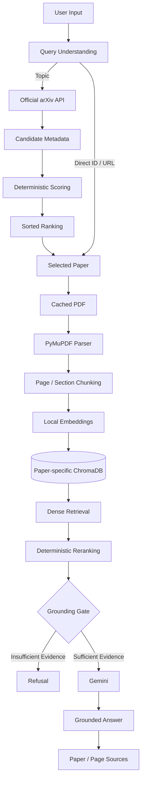

# 🔬 ArXiv Research Copilot

<p align="center">

### ⭐ Autonomous Paper Discovery • Local RAG • Grounded Research QA


</p>

<p align="center">
  
  
  
  
  
  
</p>

---

## ⭐ Overview

**ArXiv Research Copilot** is an evidence-first AI research assistant that discovers papers through the official **arXiv API**, builds a **local RAG index**, and answers questions using retrieved evidence from the selected paper.

Instead of sending an entire paper directly to an LLM, the system follows a controlled pipeline:

```text
User Query
    ↓
Paper Discovery
    ↓
Deterministic Ranking
    ↓
PDF Processing
    ↓
Local Embeddings
    ↓
ChromaDB
    ↓
Retrieval + Reranking
    ↓
Grounding Gate
    ↓
Gemini
    ↓
Answer + Sources
```

> **Core principle: Retrieve evidence first. Generate second.**

---

## ⭐ Key Features

* 🔎 **ArXiv Paper Discovery** — Search and rank research papers using deterministic scoring.
* 📄 **Direct Paper Lookup** — Accept an arXiv ID or URL.
* 📖 **Page-Aware PDF Parsing** — Extract paper text locally with PyMuPDF.
* ✂️ **Overlapping Chunking** — Preserve page and section context.
* 🧠 **Local Embeddings** — `sentence-transformers/all-MiniLM-L6-v2`.
* 🗄️ **Paper-Isolated ChromaDB** — Separate vector collection for each paper.
* 🔍 **Two-Stage Retrieval** — Dense retrieval followed by deterministic reranking.
* 🛡️ **Grounding Gate** — Prevent Gemini from answering when evidence is insufficient.
* 📚 **Source Provenance** — Preserve paper, page, and section metadata.
* 💾 **Caching** — Reuse metadata, PDFs, indexes, and briefings.
* 🧠 **Active Paper Session** — Continue QA without repeatedly specifying the paper.
* 🐞 **Debug Mode** — Inspect retrieval and grounding behavior.
* 🧪 **Automated Tests** — Covers core workflow and failure cases.

---

## ⭐ Architecture



---

## ⭐ LangGraph Workflow

The application uses an explicit, stateful LangGraph workflow:

```text
START
  ↓
classify
  ↓
search
  ↓
index
  ↓
retrieve
  ↓
generate
  ↓
END
```

| Node       | Responsibility                                       |
| ---------- | ---------------------------------------------------- |
| `classify` | Identify topic search, direct paper, briefing, or QA |
| `search`   | Resolve papers and rank candidates                   |
| `index`    | Download/reuse PDF, parse, chunk, embed, and index   |
| `retrieve` | Retrieve and rerank relevant evidence                |
| `generate` | Generate briefing, grounded answer, or refusal       |

---

## ⭐ Workflow State

`ResearchState` carries information between LangGraph nodes.

```text
query
    ↓
classification
    ↓
papers
    ↓
selected_papers
    ↓
chunks
    ↓
retrieved_candidates
    ↓
reranked_chunks
    ↓
grounding_score
    ↓
grounded
    ↓
answer + sources
```

### State Fields

| State                  | Purpose                     |
| ---------------------- | --------------------------- |
| `query`                | User's research question    |
| `classification`       | Query type                  |
| `papers`               | arXiv candidates            |
| `selected_papers`      | Selected paper              |
| `candidate_scores`     | Ranking information         |
| `chunks`               | Parsed paper chunks         |
| `retrieved_candidates` | Initial retrieval results   |
| `reranked_chunks`      | Final evidence              |
| `grounding_score`      | Evidence strength           |
| `grounded`             | Grounding decision          |
| `answer`               | Generated response          |
| `sources`              | Paper/page provenance       |
| `active_paper_id`      | Current paper               |
| `conversation_history` | Interactive session history |
| `errors`               | Workflow failures           |

Only the required retrieved context is passed to Gemini; the complete application state is not.

---

## ⭐ Paper Discovery & Ranking

Topic searches follow:

```text
Topic
  ↓
arXiv Metadata Candidates
  ↓
Title / Abstract / Category Scoring
  ↓
Deterministic Sort
  ↓
Selected Paper
  ↓
PDF Fetch + Indexing
```

### Ranking

```text
55% → Title relevance
30% → Abstract relevance
15% → Category relevance
```

A small capped exact-title phrase bonus is also applied.

The ranking is:

* Deterministic
* Transparent
* Reproducible

**Gemini is not used as the ranker.**

### Search

```powershell
python -m app.main search "graph neural networks"
```

Search displays candidate metadata, score breakdowns, ranking order, and the selected paper.

Candidate PDFs are **not downloaded during topic search**.

---

## ⭐ Local RAG Pipeline

### PDF → Chunks

Only the selected paper enters the document pipeline.

```text
Selected PDF
    ↓
PyMuPDF
    ↓
Page-by-page extraction
    ↓
Overlapping chunks
    ↓
Metadata
```

Each chunk preserves:

```text
paper_id
chunk_id
page
section
start/end offsets
text
```

OCR is intentionally not used.

### Embeddings

Default model:

```text
sentence-transformers/all-MiniLM-L6-v2
```

Embeddings are normalized and stored in persistent ChromaDB.

```text
data/chroma/
```

Each paper receives a deterministic collection:

```text
paper_1706_03762
```

Paper-specific collections prevent cross-paper retrieval contamination.

---

## ⭐ Retrieval & Reranking

```text
Question
   ↓
Query Embedding
   ↓
Chroma Top-10
   ↓
Lexical + Vector Reranking
   ↓
Final Top-5
   ↓
Grounding Gate
   ↓
Gemini
```

The reranker combines:

* Chroma relevance
* Lightweight lexical overlap

This keeps retrieval deterministic without introducing another model.

---

## ⭐ Grounding & Hallucination Control

Before Gemini is called, the retrieved evidence is evaluated.

```text
Retrieved Evidence
       ↓
Grounding Gate
      / \
     /   \
    ❌    ✅
    ↓     ↓
 Refuse  Gemini
          ↓
   Grounded Answer
          ↓
       Sources
```

Default:

```text
GROUNDING_THRESHOLD=0.20
```

If evidence is insufficient:

```text
I couldn't find enough information in the paper to answer that.
```

Gemini is **not called** in this branch.

When evidence is sufficient, Gemini receives only the final retrieved excerpts and grounding instructions.

---

## ⭐ Source Provenance

The final answer preserves evidence back to the original document:

```text
PDF
 ↓
Parser
 ↓
Chunk
 ↓
Chroma Metadata
 ↓
Retrieval
 ↓
Reranking
 ↓
Grounding
 ↓
Gemini Context
 ↓
Answer + Sources
```

Example:

```text
Sources:
- Page 3 — Figure 1 — arXiv:1706.03762
```

Page and section metadata are never fabricated.

---

## ⭐ Active Paper Sessions

After:

```powershell
python -m app.main brief 1706.03762
```

the paper becomes active.

The lightweight session stores:

```json
{
  "paper_id": "1706.03762",
  "collection_name": "paper_1706_03762",
  "title": "Attention Is All You Need",
  "abs_url": "https://arxiv.org/abs/1706.03762"
}
```

You can then ask:

```powershell
python -m app.main ask "What architecture does the paper propose?"
```

An explicit `--paper` overrides the active session:

```powershell
python -m app.main ask "What are the key results?" --paper 1706.03762
```

Without an active paper or `--paper`, the CLI refuses to guess.

---

## ⭐ Caching

| Artifact       | Location              | Behavior                    |
| -------------- | --------------------- | --------------------------- |
| arXiv metadata | `data/arxiv.json`     | Reused across searches      |
| PDFs           | `data/pdfs/<id>.pdf`  | Valid PDFs are reused       |
| ChromaDB       | `data/chroma/`        | Persistent vector index     |
| Active paper   | `data/session.json`   | Restores paper context      |
| Briefings      | `data/briefings.json` | Reuses same-paper briefings |

Removing embeddings does not remove the cached PDF.

---

## ⭐ Debug Mode

Use:

```powershell
python -m app.main ask "What architecture does the paper propose?" --debug
```

Diagnostics include:

* Active paper
* Chroma collection
* Candidate count
* Retrieved chunk count
* Chunk IDs
* Retrieval scores
* Page/section metadata
* Grounding score
* Grounding decision

API keys and credentials are not printed.

---

## ⭐ CLI Reference

### Interactive Mode

```powershell
python -m app.main prompt
```

### Search

```powershell
python -m app.main search "retrieval augmented generation" -n 5
```

### Brief a Paper

```powershell
python -m app.main brief 1706.03762
```

```powershell
python -m app.main brief https://arxiv.org/abs/1706.03762
```

### Ask a Question

```powershell
python -m app.main ask "What is the main contribution?"
```

### Specify Paper

```powershell
python -m app.main ask "What is the main contribution?" --paper 1706.03762
```

### Debug

```powershell
python -m app.main ask "What is the main contribution?" --debug
```

### JSON Output

```powershell
python -m app.main ask "What is the main contribution?" --json
```

### Remove Local Embeddings

```powershell
python -m app.main remove 1706.03762
```

---

## ⭐ Example Workflow

```powershell
# Select and index a paper
python -m app.main brief 1706.03762

# Ask grounded questions
python -m app.main ask "What architecture does the paper propose?"

python -m app.main ask "Why was this architecture chosen?"

# Test the grounding boundary
python -m app.main ask "What does the paper not explain?"
```

Example response:

```text
Q: What architecture does the paper propose?

A: The paper proposes the Transformer architecture...

Sources:
- Page 3 — arXiv:1706.03762
```

Unsupported questions follow the refusal path instead of receiving an outside-knowledge answer.

---

## ⭐ Tech Stack

| Layer          | Technology            |
| -------------- | --------------------- |
| Language       | Python 3.10+          |
| Workflow       | LangGraph             |
| LLM            | Google Gemini         |
| Paper Source   | Official arXiv API    |
| PDF Processing | PyMuPDF               |
| Embeddings     | Sentence Transformers |
| Vector Store   | ChromaDB              |
| Testing        | Pytest                |
| Interface      | CLI                   |

---

## ⭐ Setup

### Requirements

* Python 3.10+
* Internet access
* Gemini API key

### Create Environment

```powershell
cd D:\assessmen

python -m venv .venv

.\.venv\Scripts\Activate.ps1
```

### Install Dependencies

```powershell
pip install -r requirements.txt
```

### Configure Environment

```powershell
Copy-Item .env.example .env
```

Set:

```dotenv
GEMINI_API_KEY=your_key_here
GEMINI_MODEL=gemini-flash-lite-latest
EMBEDDING_MODEL=sentence-transformers/all-MiniLM-L6-v2
GROUNDING_THRESHOLD=0.20
```

### No Additional Infrastructure Required

```text
❌ OpenAI API
❌ arXiv API key
❌ Hugging Face token
❌ PostgreSQL
❌ Redis
❌ Docker
❌ Ollama
```

---

## ⭐ Testing

Run:

```powershell
.\.venv\Scripts\python.exe -m pytest -q
```

The suite covers:

* arXiv API handling
* Direct paper resolution
* Topic ranking
* Deterministic selection
* PDF validation
* Chunking
* ChromaDB indexing
* LangGraph wiring
* Session persistence
* Embedding removal
* Retrieval and reranking
* Grounding/refusal behavior
* CLI output

Optional live integration test:

```powershell
$env:RUN_NETWORK_TESTS="1"

.\.venv\Scripts\python.exe -m pytest -q tests/test_integration.py
```

---

## ⭐ Failure Handling

The application provides actionable errors for:

```text
Invalid arXiv input
        ↓
No search results
        ↓
Network / API errors
        ↓
Invalid PDF
        ↓
Poor text extraction
        ↓
Empty chunks
        ↓
Embedding / Chroma failures
        ↓
Missing active paper
        ↓
Insufficient grounding
        ↓
Gemini failures
```

Normal user errors do not require unnecessary tracebacks.

Runtime artifacts and secrets are excluded through `.gitignore`.

---

## ⭐ Design Decisions

| Decision                       | Why                                |
| ------------------------------ | ---------------------------------- |
| **Official arXiv API**         | Reliable metadata without scraping |
| **LangGraph**                  | Explicit stateful workflow         |
| **Local embeddings**           | Low-cost and reproducible          |
| **ChromaDB**                   | Persistent local vector storage    |
| **Paper-specific collections** | Prevent cross-paper contamination  |
| **Deterministic ranking**      | Explainable and reproducible       |
| **Two-stage retrieval**        | Better evidence selection          |
| **Grounding gate**             | Prevent unsupported generation     |
| **Gemini after retrieval**     | Generate from controlled evidence  |
| **CLI-first**                  | Focused AI-engineering scope       |

---

## ⭐ Project Structure

```text
.
├── app/
│   ├── main.py
│   └── ...
│
├── data/
│   ├── pdfs/
│   ├── chroma/
│   ├── arxiv.json
│   ├── session.json
│   └── briefings.json
│
├── tests/
│   ├── ...
│   └── test_integration.py
│
├── examples/
│   └── ...
│
├── .env.example
├── .gitignore
├── MANUAL_TESTING.md
├── requirements.txt
└── README.md
```

---

## ⭐ Known Limitations

* 📄 PDF extraction is text-only; OCR is not supported.
* 📑 Section detection is heuristic.
* 🧠 Lightweight embeddings are designed for focused local corpora.
* 📊 Ranking is heuristic rather than learned.
* 🌐 arXiv and Gemini require network access.
* ⚡ Gemini free-tier quotas may limit usage.

---

## ⭐ Future Improvements

* [ ] Retrieval evaluation benchmark
* [ ] Improved multi-column PDF parsing
* [ ] Streaming responses
* [ ] Retrieval telemetry
* [ ] Safe multi-paper comparison

---

## ⭐ What This Project Demonstrates

```text
              AI ENGINEERING
                    │
       ┌────────────┼────────────┐
       ▼            ▼            ▼
      RAG       Agent Workflow   LLM
       │            │            │
       ▼            ▼            ▼
  Embeddings    LangGraph      Gemini
  ChromaDB      State          Grounding
  Reranking     Routing        Prompting
       │            │            │
       └────────────┼────────────┘
                    ▼
             Engineering Layer
                    │
       ┌────────────┼────────────┐
       ▼            ▼            ▼
    Caching      Testing      Error Handling
       │            │            │
       └────────────┼────────────┘
                    ▼
              Explainable RAG
```

The project demonstrates that an LLM application is more than an API call—it requires **retrieval, state management, grounding, provenance, caching, testing, and failure handling** around the model.

---

<p align="center">

## ⭐ Evidence First. Answers Second.

**Python • LangGraph • ChromaDB • Gemini • arXiv • RAG**

</p>
