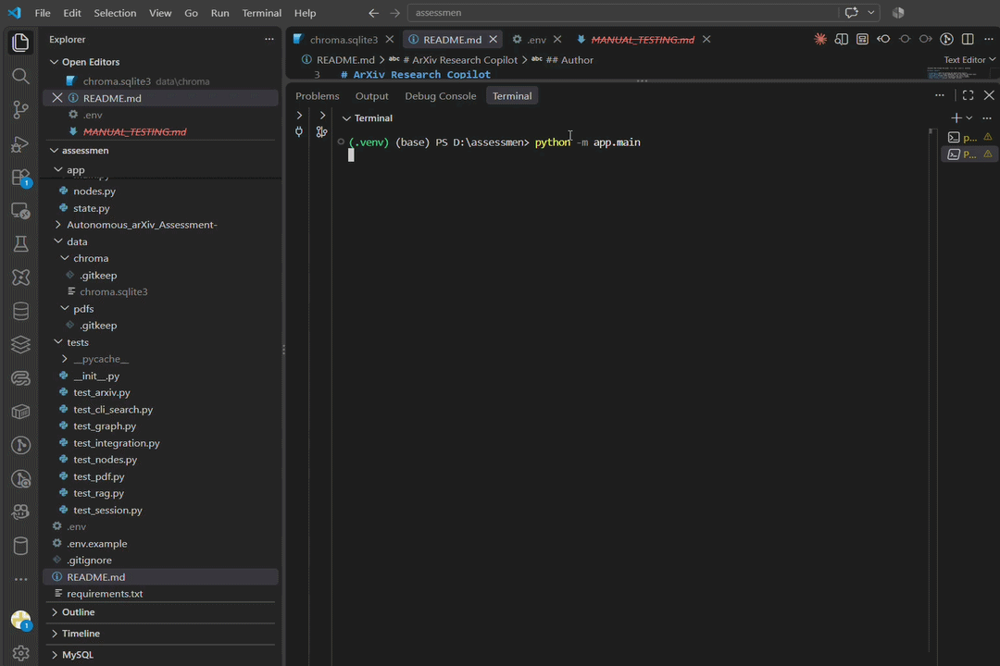

# 🔬 ArXiv Research Copilot

<p align="center">
  
</p>

<p align="center">

**Discover → Retrieve → Ground → Generate → Cite**

Local-first RAG research assistant for discovering arXiv papers, generating research briefings, and answering paper-specific questions with grounded evidence.

</p>

<p align="center">


</p>

---

## 📌 Overview

**ArXiv Research Copilot** automates the workflow of finding and understanding research papers from arXiv.

It combines:

* Official arXiv API
* Deterministic paper ranking
* Local PDF processing
* Page-aware chunking
* Local sentence embeddings
* ChromaDB vector search
* Retrieval and reranking
* Grounding validation
* Gemini for grounded generation
* Paper/page source provenance

### Core Principle

> **Retrieve evidence first. Generate only when the evidence is sufficient.**

---

# 🏗️ Architecture

```text
                         ┌─────────────────────┐
                         │        USER         │
                         │     Query / QA      │
                         └──────────┬──────────┘
                                    │
                                    ▼
                         ┌─────────────────────┐
                         │   QUERY CLASSIFY    │
                         │ Search / Paper / QA │
                         └──────────┬──────────┘
                                    │
                                    ▼
                    ┌──────────────────────────────┐
                    │       PAPER DISCOVERY        │
                    │       Official arXiv API     │
                    └──────────────┬───────────────┘
                                   │
                                   ▼
                    ┌──────────────────────────────┐
                    │   DETERMINISTIC RANKING      │
                    │                              │
                    │   Title      → 55%           │
                    │   Abstract   → 30%           │
                    │   Category   → 15%           │
                    │   Title phrase bonus         │
                    └──────────────┬───────────────┘
                                   │
                                   ▼
                    ┌──────────────────────────────┐
                    │       SELECTED PAPER         │
                    │       arXiv ID + Metadata    │
                    └──────────────┬───────────────┘
                                   │
                                   ▼
                    ┌──────────────────────────────┐
                    │          PDF CACHE            │
                    │       data/pdfs/*.pdf        │
                    └──────────────┬───────────────┘
                                   │
                                   ▼
                    ┌──────────────────────────────┐
                    │           PyMuPDF             │
                    │       PDF Text Extraction     │
                    └──────────────┬───────────────┘
                                   │
                                   ▼
                    ┌──────────────────────────────┐
                    │      PAGE-AWARE CHUNKING      │
                    │   Page + Section + Chunk ID  │
                    └──────────────┬───────────────┘
                                   │
                                   ▼
                    ┌──────────────────────────────┐
                    │      LOCAL EMBEDDINGS         │
                    │       all-MiniLM-L6-v2        │
                    └──────────────┬───────────────┘
                                   │
                                   ▼
                    ┌──────────────────────────────┐
                    │          CHROMADB              │
                    │   Paper-specific collection  │
                    └──────────────┬───────────────┘
                                   │
                                   ▼
                    ┌──────────────────────────────┐
                    │       TOP-K RETRIEVAL         │
                    │       Relevant Chunks        │
                    └──────────────┬───────────────┘
                                   │
                                   ▼
                    ┌──────────────────────────────┐
                    │          RERANKING             │
                    │       Best Evidence           │
                    └──────────────┬───────────────┘
                                   │
                                   ▼
                         ┌─────────────────────┐
                         │   GROUNDING GATE    │
                         │   Score >= 0.20 ?   │
                         └──────────┬──────────┘
                                    │
                         ┌──────────┴──────────┐
                         │                     │
                        YES                    NO
                         │                     │
                         ▼                     ▼
              ┌──────────────────┐   ┌──────────────────┐
              │      GEMINI      │   │     REFUSAL      │
              │ Grounded Prompt  │   │ Insufficient     │
              │ + Evidence       │   │ Evidence         │
              └────────┬─────────┘   └──────────────────┘
                       │
                       ▼
              ┌──────────────────┐
              │ GROUNDED ANSWER  │
              │ Answer + Sources │
              │ + Page Numbers   │
              └──────────────────┘
```

---

# 🔄 LangGraph State Graph

The application uses **LangGraph** to explicitly model the workflow.

```text
                         ┌──────────────┐
                         │    START     │
                         └──────┬───────┘
                                │
                                ▼
                       ┌────────────────┐
                       │    classify    │
                       │   Query type   │
                       └───────┬────────┘
                               │
                               ▼
                       ┌────────────────┐
                       │     search     │
                       │ arXiv + rank   │
                       └───────┬────────┘
                               │
                               ▼
                       ┌────────────────┐
                       │     index      │
                       │ PDF → chunks   │
                       │ → embeddings   │
                       └───────┬────────┘
                               │
                               ▼
                       ┌────────────────┐
                       │    retrieve    │
                       │ ChromaDB +     │
                       │ reranking      │
                       └───────┬────────┘
                               │
                               ▼
                       ┌────────────────┐
                       │    generate    │
                       │ Grounding +    │
                       │ Gemini QA      │
                       └───────┬────────┘
                               │
                               ▼
                         ┌──────────────┐
                         │     END      │
                         └──────────────┘
```

### State Graph

```text
START
  │
  ▼
classify
  │
  ▼
search
  │
  ▼
index
  │
  ▼
retrieve
  │
  ▼
generate
  │
  ▼
END
```

### Grounding Decision

```text
retrieve
   │
   ▼
Grounding Score
   │
   ├── >= 0.20 ──→ Gemini ──→ Grounded Answer
   │
   └── < 0.20 ──→ Refusal
```

---

# 🧩 State Shape

```text
ResearchState
│
├── Input
│   ├── query
│   ├── classification
│   └── max_results
│
├── Discovery
│   ├── papers
│   ├── selected_papers
│   └── candidate_scores
│
├── Paper Context
│   ├── direct_paper_id
│   ├── context_paper_id
│   └── active_paper_id
│
├── Indexing
│   ├── chunks
│   └── collection_name
│
├── Retrieval
│   ├── retrieved_candidates
│   ├── reranked_chunks
│   └── retrieved
│
├── Grounding
│   ├── grounding_score
│   └── grounded
│
├── Generation
│   ├── briefing
│   ├── answer
│   └── sources
│
├── Session
│   └── conversation_history
│
└── Errors
    └── errors
```

---

# 🛠️ Tech Stack

| Technology                | Purpose                |
| ------------------------- | ---------------------- |
| **Python 3.10+**          | Core application       |
| **LangGraph**             | State graph / workflow |
| **arXiv API**             | Paper discovery        |
| **PyMuPDF**               | PDF extraction         |
| **Sentence Transformers** | Local embeddings       |
| **ChromaDB**              | Vector database        |
| **Google Gemini**         | Grounded generation    |
| **Pydantic**              | State validation       |
| **argparse + CLI**        | Interface              |
| **pytest**                | Testing                |

---

# ⚙️ Setup & Run

### Requirements

* Python 3.10+
* Internet connection
* Gemini API key

### 1. Clone

```bash
git clone https://github.com/amruthssss/Autonomous_arXiv_Assessment-.git
cd Autonomous_arXiv_Assessment-
```

### 2. Create Virtual Environment

**Windows**

```powershell
python -m venv .venv
.\.venv\Scripts\Activate.ps1
```

**macOS / Linux**

```bash
python3 -m venv .venv
source .venv/bin/activate
```

### 3. Install

```bash
pip install -r requirements.txt
```

### 4. Configure `.env`

```env
GEMINI_API_KEY=your_key_here
GEMINI_MODEL=gemini-flash-lite-latest
EMBEDDING_MODEL=sentence-transformers/all-MiniLM-L6-v2
GROUNDING_THRESHOLD=0.20
```

### 5. Run

```bash
python -m app.main
```

---

# 💻 Example Run

### Search

```text
> search retrieval augmented generation
```

Example:

```text
1. Retrieval-Augmented Generation for Knowledge-Intensive NLP Tasks
2. Improving Retrieval-Augmented Generation
3. Dense Passage Retrieval for Open-Domain Question Answering
```

### Select → Fetch → Brief

```text
> select 1
> fetch
> summarise
```

Processing:

```text
arXiv
  ↓
PDF
  ↓
PyMuPDF
  ↓
Page-aware Chunks
  ↓
Local Embeddings
  ↓
ChromaDB
  ↓
Research Briefing
```

---

# 📝 Example Briefing

```text
Research Briefing

Title:
Retrieval-Augmented Generation for Knowledge-Intensive NLP Tasks

Problem:
The paper addresses limitations of parametric-only language models
for knowledge-intensive tasks.

Approach:
The system combines retrieval with generation so external information
can be incorporated during generation.

Key Contribution:
A retrieval-augmented generation framework for knowledge-intensive NLP.

Sources:
Page 1 — Introduction
Page 2 — Model Architecture
```

---

# 💬 Sample QA

### Q1

```text
> ask What is the main contribution?
```

```text
Answer:
The paper introduces a retrieval-augmented generation approach
that combines a retriever with a generator, allowing external
knowledge to be incorporated during generation.

Source:
Page 1 — Introduction
Page 2 — Model Architecture
```

### Q2

```text
> ask What problem does the paper address?
```

```text
Answer:
The paper addresses limitations of parametric-only models for
knowledge-intensive tasks by allowing the system to retrieve
external information.

Source:
Page 1 — Introduction
```

### Q3 — Insufficient Evidence

```text
> ask What are the limitations of the authors' deployment architecture?
```

```text
I couldn't find enough information in the paper to answer that.
```

If evidence is below the grounding threshold, **Gemini is not called**.

---

# 🎥 Live Demo

<p align="center">



</p>

<p align="center">

**Search → Fetch → Index → Brief → Ask → Grounded Answer**

</p>

---

# 🧠 Design Decisions & Tradeoffs

### LangGraph

**Choice:** Explicit state-based workflow.

**Why:** Makes processing stages and state transitions easier to test and debug.

**Tradeoff:** More structure than a simple sequential Python script.

### Local Embeddings

**Choice:** `all-MiniLM-L6-v2`.

**Why:** Runs locally without an additional embedding API.

**Tradeoff:** Lightweight model compared with larger embedding models.

### Deterministic Ranking

```text
Title similarity     → 55%
Abstract similarity  → 30%
Category match       → 15%
Exact-title bonus
```

**Why:** Reproducible and easy to debug.

**Tradeoff:** A learned reranker could improve semantic ranking.

### Paper Isolation

Each paper receives its own ChromaDB collection.

```text
paper_1706_03762
paper_<id>
paper_<id>
```

**Why:** Prevents unrelated papers from contaminating paper-specific retrieval.

**Tradeoff:** Additional collection management.

### Grounding Before Generation

```text
Evidence
   ↓
Grounding Score
   ↓
>= 0.20 ?
   ├── YES → Gemini
   └── NO  → Refusal
```

**Why:** Reduces unsupported paper-specific answers.

**Tradeoff:** The threshold is currently heuristic.

---

# ⚠️ Known Limitations & Future Improvements

| Limitation                                | Improvement                                       |
| ----------------------------------------- | ------------------------------------------------- |
| Complex PDF layouts may parse imperfectly | Add layout-aware parsing                          |
| Scanned PDFs are not OCR processed        | Add OCR preprocessing                             |
| Retrieval uses lightweight heuristics     | Benchmark stronger embeddings + learned reranking |
| Grounding threshold is heuristic          | Build an evidence benchmark and calibrate it      |
| CLI-focused application                   | Add web UI and multi-paper comparison             |

---

# 🧪 Testing

The project includes unit, graph, CLI, RAG and integration tests.

```bash
python -m pytest -q
```

Current result:

```text
15 passed
```

---

# 🔗 Repository

**GitHub:**
https://github.com/amruthssss/Autonomous_arXiv_Assessment-

---

# 👨‍💻 Author

**Amruth Sharma**

[GitHub](https://github.com/amruthssss) • [LinkedIn](https://www.linkedin.com/in/amruthssharma)

---

<p align="center">


</p>

<p align="center">

**Discover papers. Retrieve evidence. Generate grounded answers.**

</p>
