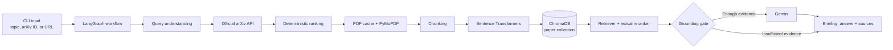

## Project Header

<div align="center">

# ArXiv Research Copilot

### Autonomous paper discovery, local RAG indexing, and grounded research Q&A


</div>

## Overview

ArXiv Research Copilot is a stateful command-line research assistant for finding and understanding arXiv papers. It accepts a natural-language topic, arXiv ID, or arXiv URL; selects a relevant paper; downloads and parses the PDF; builds a local vector index; and produces a concise briefing.

Questions are answered through retrieval-augmented generation: Gemini receives only relevant chunks retrieved from the selected paper, with page and section sources. When the evidence is insufficient, the assistant refuses instead of inventing an answer.

## Key Features

| Capability | What it does |
| --- | --- |
| **Topic discovery** | Searches the official arXiv API and ranks candidates using deterministic title, abstract, and category relevance. |
| **Direct paper resolution** | Accepts an arXiv ID or URL without requiring a topic search. |
| **Local document pipeline** | Caches PDFs, extracts page-aware text with PyMuPDF, and creates overlapping section-aware chunks. |
| **Private local RAG index** | Embeds chunks locally with Sentence Transformers and stores them in paper-isolated ChromaDB collections. |
| **Grounded briefing** | Generates a structured executive summary, methods, findings, limitations, and follow-up questions. |
| **Evidence-first QA** | Retrieves and reranks relevant chunks before calling Gemini, then returns source locations. |
| **Persistent active paper** | Keeps the latest paper available for follow-up questions without repeating `--paper`. |
| **Operational controls** | Supports JSON output, retrieval diagnostics, caching, and safe per-paper embedding removal. |

## System Architecture



The workflow is explicit and stateful: classification and search happen before document processing, while QA retrieves only from the selected paper's ChromaDB collection. Gemini is used for synthesis, not as a substitute for retrieval.

## Tech Stack

| Area | Technologies |
| --- | --- |
| Language | Python 3.10+ |
| Workflow | LangGraph |
| LLM | Google Gemini API via `google-genai` |
| Retrieval | Sentence Transformers, deterministic lexical/vector reranking |
| Document processing | PyMuPDF |
| Vector storage | ChromaDB |
| Validation | Pydantic |
| Source API | Official arXiv API client |
| Interface | Python CLI with `argparse` |
| Testing | pytest |

## Project Structure

```text
project/
├── app/
│   ├── main.py                 # CLI commands and output
│   ├── graph.py                # LangGraph workflow
│   ├── nodes.py                # Search, indexing, retrieval, briefing, QA
│   ├── state.py                # Typed workflow state and Pydantic models
│   └── services/               # arXiv, PDF, embeddings, Chroma, Gemini, config
├── tests/                      # Unit and integration tests
├── examples/                   # Example inputs and outputs
├── .env.example                # Environment variable template
├── .gitignore                  # Runtime and secret exclusions
├── requirements.txt            # Python dependencies
└── README.md
```

Runtime artifacts are created under `data/` and ignored by Git: cached PDFs, ChromaDB data, metadata, briefing cache, and the active-paper session.

## Installation & Setup

```bash
git clone https://github.com/amruthssss/Autonomous_arXiv_Assessment-.git
cd Autonomous_arXiv_Assessment-

python -m venv .venv
# Windows PowerShell
.venv\Scripts\Activate.ps1
# macOS/Linux
# source .venv/bin/activate

python -m pip install --upgrade pip
pip install -r requirements.txt
```

Create `.env` from `.env.example` and set the required Gemini key:

```dotenv
GEMINI_API_KEY=your_gemini_api_key
GEMINI_MODEL=gemini-flash-lite-latest
EMBEDDING_MODEL=sentence-transformers/all-MiniLM-L6-v2
GROUNDING_THRESHOLD=0.20
```

No external database or manual data initialization is required. `data/` and its local indexes are created automatically on first use.

## Usage

Search a topic and inspect ranked candidates:

```bash
python -m app.main search "retrieval augmented generation for medical question answering"
```

Generate a briefing from a paper:

```bash
python -m app.main brief 1706.03762
```

Ask a grounded question using the active paper:

```bash
python -m app.main ask "What is the main contribution?"
```

Use an explicit paper, JSON output, or retrieval diagnostics when needed:

```bash
python -m app.main ask "How does the method work?" --paper 1706.03762
python -m app.main brief 1706.03762 --json
python -m app.main ask "What are the limitations?" --debug
```

Remove only one paper's local embeddings:

```bash
python -m app.main remove 1706.03762
```

The `prompt` command combines briefing and interactive follow-up Q&A:

```bash
python -m app.main prompt "graph neural networks"
```

## Results / Screenshots

The project is CLI-first, so representative output is available directly by running the commands above. No committed screenshots are included in the repository; this section intentionally avoids fabricated UI images or metrics.

```text
Selected paper → local PDF parsing → ChromaDB retrieval
             → grounded Gemini answer → page/section sources
```

## Limitations

- PDF extraction quality depends on the paper's text layout; scanned PDFs are not OCR-processed.
- Local embedding models require an initial download and available machine resources.
- Gemini access requires a valid API key and network connectivity.
- The current interface is a CLI rather than a hosted web application.

## Future Improvements

- Add optional citation export for notes and reference managers.
- Improve table, equation, and figure extraction for complex PDFs.
- Add configurable retrieval and reranking profiles for larger papers.
- Add a lightweight web interface without changing the core RAG workflow.

## Author

**Amruth S Sharma**

[](https://github.com/amruthssss)
[](https://www.linkedin.com/in/amruthssharma)
