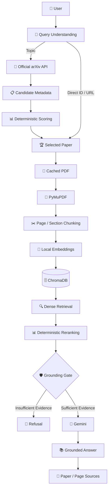
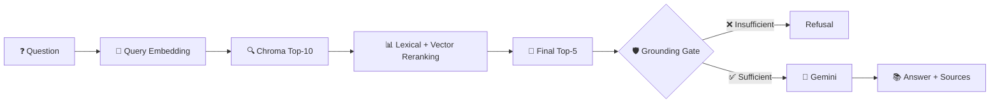

# 🔬 ArXiv Research Copilot

<p align="center">


</p>

<p align="center">

<strong>Discover research papers, build a local knowledge base, and ask evidence-grounded questions.</strong>

<p align="center">
  
  
  
  
  
  
  
</p>

---
## ⭐ Overview

**ArXiv Research Copilot** is an evidence-first AI research assistant built around a controlled **Retrieval-Augmented Generation (RAG)** pipeline.

It uses the official **arXiv API** to discover papers, selects a paper using deterministic ranking, processes the PDF locally, indexes its content in **ChromaDB**, retrieves relevant evidence, and uses **Gemini** only after a grounding check.

```text
                         🔬 ARXIV RESEARCH COPILOT

                              User Query
                                  │
                                  ▼
                         🧠 Query Classification
                                  │
                    ┌─────────────┴─────────────┐
                    ▼                           ▼
              🔎 Topic Search              📄 Direct Paper
                    │                           │
                    ▼                           │
             arXiv API                         │
                    │                           │
                    ▼                           │
          📊 Deterministic Ranking             │
                    │                           │
                    └─────────────┬─────────────┘
                                  ▼
                           Selected Paper
                                  │
                                  ▼
                          📥 Cached PDF
                                  │
                                  ▼
                         📖 PyMuPDF Parser
                                  │
                                  ▼
                         ✂️ Page-aware Chunks
                                  │
                                  ▼
                       🧠 Local Embeddings
                                  │
                                  ▼
                         🗄️ ChromaDB
                                  │
                                  ▼
                         🔍 Top-K Retrieval
                                  │
                                  ▼
                         📊 Reranking
                                  │
                                  ▼
                         🛡️ Grounding Gate
                            /           \
                           /             \
                          ❌              ✅
                          │               │
                       Refusal         Gemini
                                          │
                                          ▼
                                📚 Grounded Answer
                                          │
                                          ▼
                                    🔗 Sources
```

> **Core principle:** The LLM is not treated as the source of truth.
> **Retrieved paper evidence is the source of truth.**

---

# ⭐ Why This Project?

A basic paper chatbot often follows:

```text
PDF → LLM → Answer
```

This project uses a more controlled architecture:

```text
Paper
  ↓
Parse
  ↓
Chunk
  ↓
Embed
  ↓
Retrieve
  ↓
Rerank
  ↓
Ground
  ↓
Generate
  ↓
Cite
```

This makes the system easier to **inspect, test, debug, and reason about**.

---

# ⭐ Key Features

| Feature                        | Description                                 |
| ------------------------------ | ------------------------------------------- |
| 🔎 **Paper Discovery**         | Search official arXiv metadata              |
| 📊 **Deterministic Ranking**   | Rank candidates before downloading PDFs     |
| 📄 **Local PDF Processing**    | Extract text page-by-page with PyMuPDF      |
| ✂️ **Page-Aware Chunking**     | Preserve page, section, and offset metadata |
| 🧠 **Local Embeddings**        | `all-MiniLM-L6-v2`                          |
| 🗄️ **Paper Isolation**        | Dedicated ChromaDB collection per paper     |
| 🔍 **Two-Stage Retrieval**     | Dense retrieval + deterministic reranking   |
| 🛡️ **Grounding Gate**         | Reject unsupported questions                |
| 🤖 **Controlled Gemini Calls** | LLM receives retrieved evidence only        |
| 📚 **Source Provenance**       | Preserve paper/page/section references      |
| 💾 **Caching**                 | Reuse metadata, PDFs, indexes and briefings |
| 🧠 **Active Paper Session**    | Continue QA without repeating paper ID      |
| 🐞 **Debug Mode**              | Inspect retrieval and grounding decisions   |
| 🧪 **Automated Tests**         | Validate core workflow and failure cases    |

---

# ⭐ System Architecture



---

# ⭐ LangGraph Workflow

The application is implemented as an explicit stateful workflow:


### Node Responsibilities

| Node       | Responsibility                                   |
| ---------- | ------------------------------------------------ |
| `classify` | Identify query type                              |
| `search`   | Resolve papers and rank candidates               |
| `index`    | Parse, chunk, embed and store the selected paper |
| `retrieve` | Retrieve and rerank evidence                     |
| `generate` | Produce briefing, grounded answer, or refusal    |

Topic searches select a paper before indexing begins. Direct paper requests bypass candidate ranking and resolve the requested paper directly.

---

# ⭐ Workflow State

`ResearchState` carries information between LangGraph nodes.

```text
                         ResearchState
                              │
        ┌─────────────────────┼─────────────────────┐
        │                     │                     │
        ▼                     ▼                     ▼
     Discovery             Indexing             Retrieval
        │                     │                     │
   papers                  chunks            retrieved_candidates
   scores                  collection         reranked_chunks
   selected_papers                              retrieved
        │                     │                     │
        └─────────────────────┼─────────────────────┘
                              ▼
                         Grounding
                              │
                     grounding_score
                         grounded
                              │
                              ▼
                         Generation
                              │
                     answer + sources
```

### State Fields

| Group             | Fields                                                   |
| ----------------- | -------------------------------------------------------- |
| **Input**         | `query`, `classification`, `max_results`                 |
| **Discovery**     | `papers`, `selected_papers`, `candidate_scores`          |
| **Paper Context** | `direct_paper_id`, `context_paper_id`, `active_paper_id` |
| **Indexing**      | `chunks`, `collection_name`                              |
| **Retrieval**     | `retrieved_candidates`, `reranked_chunks`, `retrieved`   |
| **Grounding**     | `grounding_score`, `grounded`                            |
| **Generation**    | `briefing`, `answer`, `sources`                          |
| **Session**       | `conversation_history`                                   |
| **Errors**        | `errors`                                                 |

Only the required retrieved context is sent to Gemini—not the entire application state.

---

# ⭐ Paper Discovery & Ranking

```text
Topic
  │
  ▼
arXiv Metadata
  │
  ▼
Candidate Papers
  │
  ▼
Title / Abstract / Category Scoring
  │
  ▼
Deterministic Sort
  │
  ▼
Selected Paper
  │
  ▼
PDF Fetch + Index
```

### Ranking Formula

```text
Title relevance       × 0.55
Abstract relevance    × 0.30
Category relevance    × 0.15
                         ─────
                         1.00
```

A small capped exact-title phrase bonus is also applied.

### Design Goal

The ranking is intentionally:

* Deterministic
* Transparent
* Reproducible
* Easy to inspect

**Gemini is never used as the paper ranker.**

### Example

```powershell
python -m app.main search "graph neural networks"
```

Search returns candidate metadata, score breakdowns, ranking order, and the selected paper.

> Candidate PDFs are not downloaded during topic search.

---

# ⭐ Local RAG Pipeline

## 📄 PDF Processing

Only the selected paper enters the document pipeline.

```text
Selected PDF
     ↓
PyMuPDF
     ↓
Page-by-page extraction
     ↓
Section detection
     ↓
Overlapping chunks
```

Each chunk preserves:

```text
paper_id
chunk_id
page
section
start_offset
end_offset
text
```

This metadata allows retrieved evidence to remain traceable to the original paper.

---

## 🧠 Embeddings

Default model:

```text
sentence-transformers/all-MiniLM-L6-v2
```

The embeddings run locally and require no Hugging Face token.

---

## 🗄️ ChromaDB

Embeddings are stored in:

```text
data/chroma/
```

Each paper receives its own deterministic collection:

```text
paper_1706_03762
```

```text
Paper A ──→ Chroma Collection A
Paper B ──→ Chroma Collection B
Paper C ──→ Chroma Collection C
```

This prevents chunks from unrelated papers from contaminating QA.

---

# ⭐ Retrieval Pipeline



The reranker combines the Chroma relevance score with lightweight lexical overlap.

This provides a broader first-stage retrieval followed by a smaller evidence set for generation.

---

# ⭐ Grounding & Hallucination Control

The grounding gate is executed **before Gemini**.

```text
                 Retrieved Evidence
                        │
                        ▼
                 🛡️ Grounding Gate
                    /          \
                   /            \
          Insufficient          Sufficient
               │                    │
               ▼                    ▼
          🚫 Refusal              Gemini
                                    │
                                    ▼
                           Grounded Answer
                                    │
                                    ▼
                                Sources
```

Default threshold:

```dotenv
GROUNDING_THRESHOLD=0.20
```

If evidence is insufficient:

```text
I couldn't find enough information in the paper to answer that.
```

### Important Behavior

```text
Insufficient Evidence
        ↓
Gemini is NOT called
```

When sufficient evidence exists, Gemini receives only the retrieved excerpts and instructions to avoid unsupported external knowledge.

---

# ⭐ Source Provenance

The system maintains provenance throughout the complete pipeline:

```text
PDF
 ↓
Parser
 ↓
Chunk
 ↓
Chroma Metadata
 ↓
Retrieval
 ↓
Reranking
 ↓
Grounding
 ↓
Gemini Context
 ↓
Answer
 ↓
Sources
```

Example:

```text
Sources:
- Page 3 — Figure 1 — arXiv:1706.03762
```

Page and section information is taken from stored document metadata rather than generated by the LLM.

---

# ⭐ Active Paper Sessions

After:

```powershell
python -m app.main brief 1706.03762
```

the paper becomes the active research context.

The session stores lightweight metadata:

```json
{
  "paper_id": "1706.03762",
  "collection_name": "paper_1706_03762",
  "title": "Attention Is All You Need",
  "abs_url": "https://arxiv.org/abs/1706.03762"
}
```

You can then ask:

```powershell
python -m app.main ask "What architecture does the paper propose?"
```

An explicit paper overrides the active session:

```powershell
python -m app.main ask "What are the key results?" --paper 1706.03762
```

Without an active paper or explicit `--paper`, the CLI refuses to guess.

---

# ⭐ Caching Strategy

| Artifact       | Location              | Purpose                    |
| -------------- | --------------------- | -------------------------- |
| arXiv metadata | `data/arxiv.json`     | Reuse API results          |
| PDFs           | `data/pdfs/<id>.pdf`  | Avoid repeated downloads   |
| ChromaDB       | `data/chroma/`        | Persistent vector indexes  |
| Active paper   | `data/session.json`   | Restore paper context      |
| Briefings      | `data/briefings.json` | Reuse same-paper briefings |

Removing embeddings intentionally leaves the cached PDF available for re-indexing.

---

# ⭐ CLI

### 🔎 Search

```powershell
python -m app.main search "retrieval augmented generation" -n 5
```

### 📄 Brief a Paper

```powershell
python -m app.main brief 1706.03762
```

```powershell
python -m app.main brief https://arxiv.org/abs/1706.03762
```

### 💬 Ask

```powershell
python -m app.main ask "What is the main contribution?"
```

### 🎯 Specify Paper

```powershell
python -m app.main ask "What is the main contribution?" --paper 1706.03762
```

### 🐞 Debug

```powershell
python -m app.main ask "What is the main contribution?" --debug
```

### 📦 JSON

```powershell
python -m app.main ask "What is the main contribution?" --json
```

### ♻️ Remove Index

```powershell
python -m app.main remove 1706.03762
```

### 🧑‍💻 Interactive Mode

```powershell
python -m app.main prompt
```

---

# ⭐ Example Workflow

```text
1. Search / select paper
        ↓
2. Build local index
        ↓
3. Ask research question
        ↓
4. Retrieve evidence
        ↓
5. Ground response
        ↓
6. Generate answer
        ↓
7. Show sources
```

Example:

```powershell
python -m app.main brief 1706.03762

python -m app.main ask "What architecture does the paper propose?"

python -m app.main ask "Why was this architecture chosen?"

python -m app.main ask "What does the paper not explain?"
```

### Grounded Question

```text
Q: What architecture does the paper propose?

A: The paper proposes the Transformer architecture...

Sources:
• Page 3 — arXiv:1706.03762
```

### Unsupported Question

```text
Q: What does the paper not explain?

A: I couldn't find enough information in the paper to answer that.
```

---

# ⭐ Tech Stack

```text
┌──────────────────────────────────────────┐
│              APPLICATION                 │
│                  Python                  │
├──────────────────────────────────────────┤
│              WORKFLOW                    │
│                LangGraph                 │
├──────────────────────────────────────────┤
│                 LLM                      │
│                Gemini                    │
├──────────────────────────────────────────┤
│               RETRIEVAL                  │
│ Sentence Transformers + ChromaDB         │
├──────────────────────────────────────────┤
│             DOCUMENTS                    │
│               PyMuPDF                    │
├──────────────────────────────────────────┤
│              SOURCE                      │
│             arXiv API                    │
├──────────────────────────────────────────┤
│              TESTING                     │
│                Pytest                    │
└──────────────────────────────────────────┘
```

| Layer        | Technology            |
| ------------ | --------------------- |
| Language     | Python 3.10+          |
| Workflow     | LangGraph             |
| LLM          | Google Gemini         |
| Paper Source | Official arXiv API    |
| PDF Parser   | PyMuPDF               |
| Embeddings   | Sentence Transformers |
| Vector Store | ChromaDB              |
| Testing      | Pytest                |
| Interface    | CLI                   |

---

# ⭐ Setup

## Requirements

* Python 3.10+
* Internet access
* Gemini API key

## 1. Create Environment

```powershell
python -m venv .venv

.\.venv\Scripts\Activate.ps1
```

## 2. Install Dependencies

```powershell
pip install -r requirements.txt
```

## 3. Configure Environment

```powershell
Copy-Item .env.example .env
```

Set:

```dotenv
GEMINI_API_KEY=your_key_here
GEMINI_MODEL=gemini-flash-lite-latest
EMBEDDING_MODEL=sentence-transformers/all-MiniLM-L6-v2
GROUNDING_THRESHOLD=0.20
```

### No Additional Infrastructure

```text
❌ OpenAI API
❌ arXiv API key
❌ Hugging Face token
❌ PostgreSQL
❌ Redis
❌ Docker
❌ Ollama
❌ Separate frontend
```

---

# ⭐ Testing

Run:

```powershell
.\.venv\Scripts\python.exe -m pytest -q
```

The test suite covers:

```text
✓ arXiv API handling
✓ Direct paper resolution
✓ Topic ranking
✓ Deterministic selection
✓ PDF validation
✓ Chunk generation
✓ ChromaDB indexing
✓ LangGraph workflow
✓ Active-paper persistence
✓ Embedding removal
✓ Retrieval behavior
✓ Grounding / refusal
✓ CLI output
```

### Optional Live Integration Test

```powershell
$env:RUN_NETWORK_TESTS="1"

.\.venv\Scripts\python.exe -m pytest -q tests/test_integration.py
```

---

# ⭐ Debugging & Failure Handling

The application handles:

```text
Invalid arXiv input
        ↓
No search results
        ↓
Network / API errors
        ↓
Invalid PDF
        ↓
Poor text extraction
        ↓
Empty chunks
        ↓
Embedding failures
        ↓
ChromaDB failures
        ↓
Missing active paper
        ↓
Insufficient grounding
        ↓
Gemini failures
```

Normal user errors are surfaced as actionable messages rather than unnecessary tracebacks.

Debug mode never exposes API keys or credentials.

---

# ⭐ Design Decisions

| Decision                       | Reason                                     |
| ------------------------------ | ------------------------------------------ |
| **Official arXiv API**         | Reliable metadata without scraping         |
| **LangGraph**                  | Explicit stateful workflow                 |
| **Local embeddings**           | Low-cost and reproducible                  |
| **ChromaDB**                   | Persistent local vector storage            |
| **Paper-specific collections** | Prevent cross-paper contamination          |
| **Deterministic ranking**      | Explainable and reproducible               |
| **Two-stage retrieval**        | Better evidence selection                  |
| **Grounding gate**             | Prevent unsupported generation             |
| **Gemini after retrieval**     | Generate from controlled context           |
| **CLI-first**                  | Keep the project focused on AI engineering |

---

# ⭐ Project Structure

```text
.
├── app/
│   ├── main.py
│   └── ...
│
├── data/
│   ├── pdfs/
│   ├── chroma/
│   ├── arxiv.json
│   ├── session.json
│   └── briefings.json
│
├── tests/
│   ├── ...
│   └── test_integration.py
│
├── examples/
│   └── ...
│
├── .env.example
├── .gitignore
├── MANUAL_TESTING.md
├── requirements.txt
└── README.md
```

### Directory Responsibilities

| Directory           | Purpose                            |
| ------------------- | ---------------------------------- |
| `app/`              | Application and workflow code      |
| `data/pdfs/`        | Cached arXiv PDFs                  |
| `data/chroma/`      | Persistent vector collections      |
| `tests/`            | Automated test suite               |
| `examples/`         | Optional examples                  |
| `.env.example`      | Environment configuration template |
| `MANUAL_TESTING.md` | Manual verification workflow       |

---

# ⭐ Known Limitations

* 📄 PDF extraction is text-only; OCR is not supported.
* 📑 Section detection is heuristic.
* 🧠 Lightweight embeddings are intended for focused local corpora.
* 📊 Ranking is heuristic rather than learned.
* 🌐 arXiv and Gemini require network access.
* ⚡ Gemini free-tier quotas can limit usage.
* 💬 Persistent storage keeps active-paper metadata, not the full conversation history.

---

# ⭐ Roadmap

```text
Current
  │
  ├── ✅ ArXiv discovery
  ├── ✅ Deterministic ranking
  ├── ✅ Local PDF indexing
  ├── ✅ ChromaDB RAG
  ├── ✅ Retrieval + reranking
  ├── ✅ Grounding gate
  ├── ✅ Source provenance
  └── ✅ Active paper sessions
       │
       ▼
Future
  │
  ├── ⬜ Retrieval evaluation benchmark
  ├── ⬜ Improved multi-column PDF parsing
  ├── ⬜ Streaming responses
  ├── ⬜ Retrieval telemetry
  └── ⬜ Safe multi-paper comparison
```

---

# ⭐ Project Classification

### Runtime

```text
app/
requirements.txt
.env.example
```

### Documentation & Tests

```text
README.md
MANUAL_TESTING.md
tests/
```

### Runtime Data

```text
data/pdfs/
data/chroma/
```

### Optional

```text
examples/
```

### Generated / Ignored

```text
.venv/
__pycache__/
.pytest_cache/
.env
PDF files
Chroma data
Session state
JSON caches
```

---

# ⭐ What This Project Demonstrates

```text
                     AI ENGINEERING
                           │
          ┌────────────────┼────────────────┐
          ▼                ▼                ▼
         RAG          Agent Workflow        LLM
          │                │                │
          ▼                ▼                ▼
     Embeddings         LangGraph          Gemini
     ChromaDB            State             Grounding
     Reranking           Routing           Prompting
          │                │                │
          └────────────────┼────────────────┘
                           ▼
                    ENGINEERING LAYER
                           │
             ┌─────────────┼─────────────┐
             ▼             ▼             ▼
          Caching       Testing       Error Handling
             │             │             │
             └─────────────┼─────────────┘
                           ▼
                    Explainable RAG
```

### Core Engineering Concepts

**RAG • Agentic Workflows • LangGraph • LLM Integration • Vector Search • Embeddings • Reranking • Grounding • Provenance • Caching • Testing**

---

<p align="center">

### 🔬 Discover → Retrieve → Ground → Generate → Cite

<br>

<strong>⭐ Evidence First. Answers Second.</strong>

<br><br>

<code>Python</code> • <code>LangGraph</code> • <code>ChromaDB</code> • <code>Gemini</code> • <code>arXiv</code>

</p>
