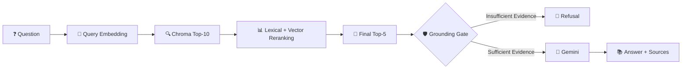

# 🔬 ArXiv Research Copilot

<p align="center">


</p>

<p align="center">
<strong>Discover research papers, build a local knowledge base, and ask evidence-grounded questions.</strong>
</p>

<p align="center">


</p>

---

# ⭐ Overview

**ArXiv Research Copilot** is an evidence-first AI research assistant built around a controlled **Retrieval-Augmented Generation (RAG)** pipeline.

The system uses the official **arXiv API** to discover papers, ranks candidates deterministically, processes the selected PDF locally with **PyMuPDF**, creates page-aware chunks, generates local embeddings, stores them in **ChromaDB**, retrieves relevant evidence, applies a grounding check, and uses **Gemini** only after sufficient evidence is found.

> **Core principle: Retrieve evidence first. Generate second.**

---

# ⭐ Architecture

```text
                         🔬 ARXIV RESEARCH COPILOT

                              User Query
                                  │
                                  ▼
                         🧠 Query Classification
                                  │
                     ┌────────────┴────────────┐
                     ▼                         ▼
               🔎 Topic Search            📄 Direct Paper
                     │                         │
                     ▼                         │
                 arXiv API                     │
                     │                         │
                     ▼                         │
            📊 Deterministic Ranking           │
                     │                         │
                     └────────────┬────────────┘
                                  ▼
                           Selected Paper
                                  │
                                  ▼
                            📥 Cached PDF
                                  │
                                  ▼
                         📖 PyMuPDF Parser
                                  │
                                  ▼
                         ✂️ Page-Aware Chunks
                                  │
                                  ▼
                         🧠 Local Embeddings
                                  │
                                  ▼
                           🗄️ ChromaDB
                                  │
                                  ▼
                         🔍 Top-K Retrieval
                                  │
                                  ▼
                           📊 Reranking
                                  │
                                  ▼
                          🛡️ Grounding Gate
                             /          \
                            /            \
                           ❌             ✅
                           │              │
                        Refusal         Gemini
                                          │
                                          ▼
                                  📚 Grounded Answer
                                          │
                                          ▼
                                       🔗 Sources
```

---

# ⭐ LangGraph State Graph

The application is implemented as an explicit stateful **LangGraph** workflow.


## Node Responsibilities

| Node       | Responsibility                                   |
| ---------- | ------------------------------------------------ |
| `classify` | Identify query type                              |
| `search`   | Resolve papers and rank candidates               |
| `index`    | Parse, chunk, embed and store the selected paper |
| `retrieve` | Retrieve and rerank evidence                     |
| `generate` | Produce briefing, grounded answer, or refusal    |

Topic searches select a paper before indexing. Direct paper requests bypass candidate ranking.

---

# ⭐ Workflow State

`ResearchState` carries information between LangGraph nodes.

```text
ResearchState
│
├── Input
│   ├── query
│   ├── classification
│   └── max_results
│
├── Discovery
│   ├── papers
│   ├── selected_papers
│   └── candidate_scores
│
├── Paper Context
│   ├── direct_paper_id
│   ├── context_paper_id
│   └── active_paper_id
│
├── Indexing
│   ├── chunks
│   └── collection_name
│
├── Retrieval
│   ├── retrieved_candidates
│   ├── reranked_chunks
│   └── retrieved
│
├── Grounding
│   ├── grounding_score
│   └── grounded
│
├── Generation
│   ├── briefing
│   ├── answer
│   └── sources
│
├── Session
│   └── conversation_history
│
└── Errors
    └── errors
```

### State Fields

| Group             | Fields                                                   |
| ----------------- | -------------------------------------------------------- |
| **Input**         | `query`, `classification`, `max_results`                 |
| **Discovery**     | `papers`, `selected_papers`, `candidate_scores`          |
| **Paper Context** | `direct_paper_id`, `context_paper_id`, `active_paper_id` |
| **Indexing**      | `chunks`, `collection_name`                              |
| **Retrieval**     | `retrieved_candidates`, `reranked_chunks`, `retrieved`   |
| **Grounding**     | `grounding_score`, `grounded`                            |
| **Generation**    | `briefing`, `answer`, `sources`                          |
| **Session**       | `conversation_history`                                   |
| **Errors**        | `errors`                                                 |

Only the required retrieved context is sent to Gemini.

---

# ⭐ Key Features

| Feature                    | Description                               |
| -------------------------- | ----------------------------------------- |
| 🔎 Paper Discovery         | Search official arXiv metadata            |
| 📊 Deterministic Ranking   | Rank candidates before downloading PDFs   |
| 📄 Local PDF Processing    | Page-by-page extraction with PyMuPDF      |
| ✂️ Page-Aware Chunking     | Preserve page and section metadata        |
| 🧠 Local Embeddings        | `all-MiniLM-L6-v2`                        |
| 🗄️ Paper Isolation        | Separate ChromaDB collection per paper    |
| 🔍 Two-Stage Retrieval     | Dense retrieval + deterministic reranking |
| 🛡️ Grounding Gate         | Reject unsupported questions              |
| 🤖 Controlled Gemini Calls | Generate only after retrieval             |
| 📚 Source Provenance       | Preserve paper/page references            |
| 💾 Caching                 | Cache PDFs, indexes and briefings         |
| 🧠 Active Paper Session    | Continue QA without repeating paper ID    |
| 🐞 Debug Mode              | Inspect retrieval and grounding           |
| 🧪 Automated Tests         | Validate workflow and failure cases       |

---

# ⭐ Paper Discovery & Ranking

```text
Topic
  │
  ▼
arXiv Metadata
  │
  ▼
Candidate Papers
  │
  ▼
Title / Abstract / Category Scoring
  │
  ▼
Deterministic Sort
  │
  ▼
Selected Paper
  │
  ▼
PDF Fetch + Index
```

### Ranking Formula

```text
Title relevance       × 0.55
Abstract relevance    × 0.30
Category relevance    × 0.15
                         ─────
                         1.00
```

A small capped exact-title phrase bonus is also applied.

The ranking is intentionally:

* deterministic
* transparent
* reproducible
* easy to inspect

**Gemini is not used as the paper ranker.**

Example:

```powershell
python -m app.main search "graph neural networks"
```

Candidate PDFs are not downloaded during topic search.

---

# ⭐ Local RAG Pipeline

## PDF Processing

```text
Selected PDF
     ↓
PyMuPDF
     ↓
Page-by-page extraction
     ↓
Section detection
     ↓
Overlapping chunks
```

Each chunk preserves:

```text
paper_id
chunk_id
page
section
start_offset
end_offset
text
```

---

## Embeddings

Default model:

```text
sentence-transformers/all-MiniLM-L6-v2
```

Embeddings run locally and require no Hugging Face token.

---

## ChromaDB

Embeddings are stored in:

```text
data/chroma/
```

Each paper receives its own deterministic collection:

```text
paper_1706_03762
```

```text
Paper A ──→ Chroma Collection A
Paper B ──→ Chroma Collection B
Paper C ──→ Chroma Collection C
```

This prevents unrelated papers from contaminating QA retrieval.

---

# ⭐ Retrieval & Grounding



The reranker combines Chroma relevance with lightweight lexical overlap.

### Grounding Threshold

```dotenv
GROUNDING_THRESHOLD=0.20
```

If evidence is insufficient:

```text
I couldn't find enough information in the paper to answer that.
```

Importantly:

```text
Insufficient Evidence
        ↓
Gemini is NOT called
```

---

# ⭐ Source Provenance

Provenance is maintained throughout the pipeline:

```text
PDF
 ↓
Parser
 ↓
Chunk
 ↓
Chroma Metadata
 ↓
Retrieval
 ↓
Reranking
 ↓
Grounding
 ↓
Gemini Context
 ↓
Answer
 ↓
Sources
```

Example:

```text
Sources:
- Page 3 — Figure 1 — arXiv:1706.03762
```

Page and section information comes from stored document metadata.

---

# ⭐ Active Paper Sessions

After:

```powershell
python -m app.main brief 1706.03762
```

the paper becomes the active research context.

The session stores:

```json
{
  "paper_id": "1706.03762",
  "collection_name": "paper_1706_03762",
  "title": "Attention Is All You Need",
  "abs_url": "https://arxiv.org/abs/1706.03762"
}
```

You can then ask:

```powershell
python -m app.main ask "What architecture does the paper propose?"
```

An explicit paper overrides the active session:

```powershell
python -m app.main ask "What are the key results?" --paper 1706.03762
```

---

# ⭐ Caching

| Artifact       | Location              | Purpose                   |
| -------------- | --------------------- | ------------------------- |
| arXiv metadata | `data/arxiv.json`     | Reuse API results         |
| PDFs           | `data/pdfs/<id>.pdf`  | Avoid repeated downloads  |
| ChromaDB       | `data/chroma/`        | Persistent vector indexes |
| Active paper   | `data/session.json`   | Restore paper context     |
| Briefings      | `data/briefings.json` | Reuse briefings           |

---

# ⭐ CLI

### Search

```powershell
python -m app.main search "retrieval augmented generation" -n 5
```

### Brief

```powershell
python -m app.main brief 1706.03762
```

```powershell
python -m app.main brief https://arxiv.org/abs/1706.03762
```

### Ask

```powershell
python -m app.main ask "What is the main contribution?"
```

### Specify Paper

```powershell
python -m app.main ask "What is the main contribution?" --paper 1706.03762
```

### Debug

```powershell
python -m app.main ask "What is the main contribution?" --debug
```

### JSON

```powershell
python -m app.main ask "What is the main contribution?" --json
```

### Remove Index

```powershell
python -m app.main remove 1706.03762
```

### Interactive Mode

```powershell
python -m app.main prompt
```

---

# ⭐ Setup & Run Locally

The project is designed to run locally with Python and freely available/open-source components.

## Requirements

* Python 3.10+
* Internet access
* Gemini API key

No additional infrastructure is required:

```text
❌ OpenAI API
❌ arXiv API key
❌ Hugging Face token
❌ PostgreSQL
❌ Redis
❌ Docker
❌ Ollama
❌ Separate frontend
```

## 1. Clone

```powershell
git clone <YOUR_GITHUB_REPOSITORY_URL>
cd <PROJECT_DIRECTORY>
```

## 2. Create Environment

```powershell
python -m venv .venv
.\.venv\Scripts\Activate.ps1
```

## 3. Install Dependencies

```powershell
pip install -r requirements.txt
```

## 4. Configure Environment

```powershell
Copy-Item .env.example .env
```

Set:

```dotenv
GEMINI_API_KEY=your_key_here
GEMINI_MODEL=gemini-flash-lite-latest
EMBEDDING_MODEL=sentence-transformers/all-MiniLM-L6-v2
GROUNDING_THRESHOLD=0.20
```

---

# ⭐ Example Run

## 1. Search

```powershell
python -m app.main search "transformer architecture"
```

Example:

```text
1. Attention Is All You Need
   https://arxiv.org/abs/1706.03762

2. ...
3. ...
```

---

## 2. Generate Briefing

```powershell
python -m app.main brief 1706.03762
```

Example format:

```text
============================================================
PAPER BRIEFING
============================================================

Title:
Attention Is All You Need

Authors:
Ashish Vaswani et al.

Summary:
The paper introduces the Transformer architecture, based
primarily on attention mechanisms rather than recurrent or
convolutional layers.

Key Contributions:
• Transformer architecture
• Multi-head self-attention
• Positional encoding
• Encoder-decoder architecture

Sources:
• arXiv:1706.03762
```

---

## 3. QA

### Question 1

```text
Q: What architecture does the paper propose?

A:
The paper proposes the Transformer architecture, which uses
attention mechanisms as the primary mechanism for modeling
relationships between input and output tokens.

Sources:
• Page 3 — arXiv:1706.03762
```

### Question 2

```text
Q: Why does the architecture use self-attention?

A:
Self-attention allows the model to relate different positions
within a sequence while enabling more parallel computation
than recurrent approaches.

Sources:
• Page 3 — arXiv:1706.03762
• Page 5 — arXiv:1706.03762
```

### Question 3 — Unsupported

```text
Q: What will be the performance of this architecture on a
future dataset that does not exist in the paper?

A:
I couldn't find enough information in the paper to answer that.
```

The third example demonstrates the grounding/refusal behavior.

> **Note:** Replace these illustrative outputs with your actual terminal output in the final submission.

---

# ⭐ Result Demo

The final submission will include a short GIF/screen recording demonstrating the actual application running locally.

### 🎥 Demo

```text
[ ADD RESULT GIF HERE ]
```

Suggested filename:

```text
assets/demo.gif
```

Then replace the placeholder above with:

```markdown

```

The GIF should demonstrate:

```text
Search
  ↓
Paper Selection
  ↓
Briefing
  ↓
Question
  ↓
Retrieved Evidence
  ↓
Grounded Answer
  ↓
Sources
```

---

# ⭐ Design Decisions & Tradeoffs

| Decision                       | Why                                  | Tradeoff                                           |
| ------------------------------ | ------------------------------------ | -------------------------------------------------- |
| **Official arXiv API**         | Structured metadata without scraping | Depends on arXiv availability                      |
| **Deterministic ranking**      | Transparent and reproducible         | Less semantic than learned ranking                 |
| **Local embeddings**           | Low-cost and locally reproducible    | Lightweight model has limited domain understanding |
| **ChromaDB**                   | Simple persistent local vector store | Less suitable for very large-scale deployments     |
| **Paper-specific collections** | Prevent cross-paper contamination    | More collection management                         |
| **Two-stage retrieval**        | Improves evidence selection          | Adds retrieval complexity                          |
| **Grounding gate**             | Prevent unsupported generation       | Can refuse when retrieval misses relevant evidence |
| **Gemini after retrieval**     | Controlled generation from evidence  | Answer quality depends on retrieval quality        |
| **CLI-first**                  | Focus on AI engineering              | No graphical interface                             |

---

# ⭐ What I Would Do With More Time

The main improvements would directly address the current limitations:

### 1. Better PDF Understanding

**Current limitation:** Text extraction may not fully preserve complex layouts such as multi-column papers, tables, figures, and equations.

**Improvement:** Use a document parser with stronger layout understanding and add OCR for scanned PDFs.

---

### 2. Better Retrieval

**Current limitation:** Ranking and reranking are heuristic.

**Improvement:** Evaluate different embedding models and introduce a learned cross-encoder reranker.

---

### 3. Retrieval Evaluation

**Current limitation:** Retrieval quality is not yet measured with a dedicated benchmark.

**Improvement:** Build a question/evidence benchmark and measure:

```text
Recall@K
Precision@K
MRR
Grounding Accuracy
Answer Faithfulness
```

---

### 4. Multi-Paper Research

**Current limitation:** The active-paper workflow is focused on one paper at a time.

**Improvement:** Add controlled multi-paper comparison while keeping evidence and citations separated by paper.

---

### 5. Better User Experience

**Current limitation:** The project is CLI-first.

**Improvement:** Add a graphical interface with:

* paper search
* paper selection
* retrieved evidence
* source navigation
* QA
* retrieval/debug information

---

# ⭐ Known Limitations

Only the main practical limitations are listed here:

1. **PDF layout understanding** — complex tables, figures, equations, and multi-column layouts may not be extracted perfectly.
2. **OCR** — scanned/image-only PDFs are not currently supported.
3. **Heuristic retrieval/ranking** — ranking and reranking are not learned models.
4. **Retrieval dependency** — if the relevant evidence is not retrieved, the generation stage cannot reliably answer the question.
5. **External service dependency** — paper discovery requires arXiv access and final generation requires Gemini availability/quota.

These limitations are addressed in the **What I Would Do With More Time** section above.

---

# ⭐ Testing

Run:

```powershell
.\.venv\Scripts\python.exe -m pytest -q
```

The test suite covers:

```text
✓ arXiv API handling
✓ Direct paper resolution
✓ Topic ranking
✓ Deterministic selection
✓ PDF validation
✓ Chunk generation
✓ ChromaDB indexing
✓ LangGraph workflow
✓ Active-paper persistence
✓ Embedding removal
✓ Retrieval behavior
✓ Grounding / refusal
✓ CLI output
```

Optional live integration test:

```powershell
$env:RUN_NETWORK_TESTS="1"

.\.venv\Scripts\python.exe -m pytest -q tests/test_integration.py
```

---

# ⭐ Project Structure

```text
.
├── app/
│   ├── main.py
│   └── ...
│
├── data/
│   ├── pdfs/
│   ├── chroma/
│   ├── arxiv.json
│   ├── session.json
│   └── briefings.json
│
├── tests/
│   ├── ...
│   └── test_integration.py
│
├── examples/
│   └── ...
│
├── assets/
│   └── demo.gif
│
├── .env.example
├── .gitignore
├── MANUAL_TESTING.md
├── requirements.txt
└── README.md
```

---

# ⭐ Error Handling

The application handles failures across the workflow:

```text
Invalid arXiv Input
        ↓
No Search Results
        ↓
Network / API Error
        ↓
Invalid PDF
        ↓
Poor Text Extraction
        ↓
Empty Chunks
        ↓
Embedding Failure
        ↓
ChromaDB Failure
        ↓
Missing Active Paper
        ↓
Insufficient Grounding
        ↓
Gemini Failure
```

Normal user errors are surfaced as actionable messages.

Debug mode does not expose API keys or credentials.

---

# ⭐ Roadmap

```text
CURRENT
   │
   ├── ✅ arXiv discovery
   ├── ✅ Deterministic ranking
   ├── ✅ Local PDF indexing
   ├── ✅ ChromaDB RAG
   ├── ✅ Retrieval + reranking
   ├── ✅ Grounding gate
   ├── ✅ Source provenance
   └── ✅ Active paper sessions
   │
   ▼
FUTURE
   │
   ├── ⬜ Improved PDF parsing
   ├── ⬜ OCR support
   ├── ⬜ Learned reranking
   ├── ⬜ Retrieval evaluation
   ├── ⬜ Streaming responses
   └── ⬜ Safe multi-paper comparison
```

---

# ⭐ What This Project Demonstrates

```text
                         AI ENGINEERING
                              │
              ┌───────────────┼───────────────┐
              ▼               ▼               ▼
             RAG         Agent Workflow       LLM
              │               │               │
              ▼               ▼               ▼
         Embeddings       LangGraph         Gemini
         ChromaDB           State          Grounding
         Reranking         Routing         Prompting
              │               │               │
              └───────────────┼───────────────┘
                              ▼
                       ENGINEERING LAYER
                              │
              ┌───────────────┼───────────────┐
              ▼               ▼               ▼
           Caching          Testing       Error Handling
              │               │               │
              └───────────────┼───────────────┘
                              ▼
                       Explainable RAG
```

### Core Engineering Concepts

**RAG • Agentic Workflows • LangGraph • LLM Integration • Vector Search • Embeddings • Reranking • Grounding • Provenance • Caching • Testing**

---

# ⭐ Assessment Checklist

| Requirement              | Status            |
| ------------------------ | ----------------- |
| Architecture diagram     | ✅                 |
| State graph              | ✅                 |
| Nodes & edges            | ✅                 |
| State shape              | ✅                 |
| Setup instructions       | ✅                 |
| Local execution          | ✅                 |
| Free/open-source tooling | ✅                 |
| Example run              | ✅                 |
| Briefing example         | ✅                 |
| 2–3 QA exchanges         | ✅                 |
| Grounded QA              | ✅                 |
| Refusal behavior         | ✅                 |
| Result GIF placeholder   | 🎥 Add actual GIF |
| Design decisions         | ✅                 |
| Tradeoffs                | ✅                 |
| Future improvements      | ✅                 |
| Known limitations        | ✅                 |
| Testing                  | ✅                 |

---

<p align="center">

### 🔬 Discover → Retrieve → Ground → Generate → Cite

<br>

<strong>⭐ Evidence First. Answers Second.</strong>

<br><br>

<code>Python</code> • <code>LangGraph</code> • <code>ChromaDB</code> • <code>Gemini</code> • <code>arXiv</code>

</p>
