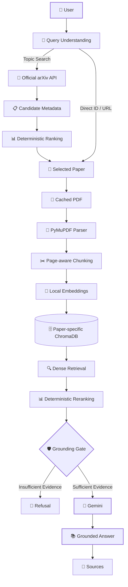

# 🔬 ArXiv Research Copilot

<p align="center">

### **From Paper Discovery → Local RAG → Grounded Research Answers**

<p align="center">
  
</p>

<p align="center">
  
  
  
  
  
  
</p>

<p align="center">
  <strong>Search official arXiv papers. Build a local knowledge base. Ask questions.</strong><br>
  <strong>Answers are generated only when sufficient evidence is retrieved.</strong>
</p>

---

## ✨ What is ArXiv Research Copilot?

**ArXiv Research Copilot** is an evidence-first AI research assistant that combines:

* 🔎 **Official arXiv paper discovery**
* 📄 **Local PDF processing**
* 🧩 **Page-aware document chunking**
* 🧠 **Local semantic embeddings**
* 🔍 **Two-stage RAG retrieval**
* 📊 **Deterministic reranking**
* 🛡️ **Grounding-based hallucination prevention**
* 🤖 **Gemini-powered grounded generation**
* 📚 **Paper/page-level source provenance**
* 🧠 **Stateful LangGraph workflow**

Instead of simply sending an entire paper to an LLM, the system builds a controlled retrieval pipeline where the model receives **only the evidence selected by the retrieval and grounding layers**.

```text
User
 │
 ▼
Query Understanding
 │
 ├────────────── Topic ──────────────┐
 │                                   ▼
 │                           Official arXiv API
 │                                   │
 │                                   ▼
 │                         Candidate Ranking
 │                                   │
 │                                   ▼
 │                            Selected Paper
 │                                   │
 └──────── Direct Paper ─────────────┘
                                     │
                                     ▼
                                PDF → Parser
                                     │
                                     ▼
                                  Chunks
                                     │
                                     ▼
                              Local Embeddings
                                     │
                                     ▼
                                  ChromaDB
                                     │
                                     ▼
                              Dense Retrieval
                                     │
                                     ▼
                               Reranking
                                     │
                                     ▼
                              Grounding Gate
                              /           \
                         insufficient    sufficient
                            │               │
                            ▼               ▼
                         Refuse          Gemini
                                            │
                                            ▼
                                  Grounded Answer
                                      + Sources
```

---

# 🎯 Why This Project?

Many paper assistants follow a simple pattern:

```text
PDF → LLM → Answer
```

This project intentionally uses a more controlled architecture:

```text
Paper
  ↓
Parse
  ↓
Chunk
  ↓
Embed
  ↓
Retrieve
  ↓
Rerank
  ↓
Grounding Check
  ↓
LLM
  ↓
Answer + Evidence
```

### Core engineering principles

| Principle                       | Implementation                             |
| ------------------------------- | ------------------------------------------ |
| **Reliable paper discovery**    | Official arXiv API                         |
| **Reproducible ranking**        | Deterministic scoring                      |
| **Local processing**            | PyMuPDF + sentence-transformers            |
| **Paper isolation**             | Dedicated ChromaDB collection              |
| **Better retrieval**            | Dense retrieval + lexical/vector reranking |
| **Hallucination control**       | Grounding gate                             |
| **Traceability**                | Page/section/chunk provenance              |
| **State management**            | LangGraph                                  |
| **Low infrastructure overhead** | Local SQLite/JSON + ChromaDB               |
| **Focused scope**               | CLI-first AI engineering system            |

---

# 🚀 Key Features

### 🔎 Intelligent Paper Discovery

Search arXiv using a research topic and receive:

* Paper title
* Authors
* Abstract preview
* arXiv ID
* Publication date
* Categories
* PDF URL
* Abstract URL
* Relevance score
* Score breakdown
* Ranked candidates

Candidate papers are ranked **before downloading PDFs**, reducing unnecessary network and processing work.

---

### 📄 Local PDF Processing

Only the selected paper enters the document pipeline.

```text
Selected Paper
     │
     ▼
Cached PDF
     │
     ▼
PyMuPDF
     │
     ▼
Page-aware text
     │
     ▼
Overlapping chunks
```

Each chunk preserves:

```text
paper_id
chunk_id
page
section
start_offset
end_offset
text
```

This allows retrieval results to remain traceable back to the original paper.

---

### 🧠 Local Embeddings

The default embedding model is:

```text
sentence-transformers/all-MiniLM-L6-v2
```

Benefits:

* Runs locally
* No Hugging Face token required
* Low-cost
* Reproducible
* Suitable for a focused research corpus

---

### 🗄️ Paper-Isolated ChromaDB

Each paper receives its own deterministic collection.

Example:

```text
paper_1706_03762
```

This prevents one paper's chunks from accidentally appearing in another paper's QA context.

```text
Paper A
   └── Chroma Collection A

Paper B
   └── Chroma Collection B

Paper C
   └── Chroma Collection C
```

---

### 🔍 Two-Stage Retrieval

The QA pipeline uses:

```text
Question
   ↓
Query Embedding
   ↓
Chroma Top-10
   ↓
Lexical + Vector Reranking
   ↓
Final Top-5
   ↓
Grounding Gate
   ↓
Gemini
```

The system first retrieves a broader candidate set and then reduces it to the most relevant evidence.

---

### 🛡️ Grounding Gate

This is one of the project's central safeguards.

Before Gemini is called, retrieved evidence is evaluated against:

```text
GROUNDING_THRESHOLD = 0.20
```

If sufficient evidence is not found:

```text
I couldn't find enough information in the paper to answer that.
```

**Gemini is not called in this branch.**

When evidence is sufficient, Gemini receives:

```text
Retrieved excerpts
+
Question
+
Grounding instructions
```

It is explicitly instructed not to introduce outside knowledge or unsupported facts.

---

### 📚 Source-Aware Answers

Answers preserve document provenance.

Example:

```text
The paper proposes the Transformer architecture,
which relies on attention mechanisms...

Sources:
- Page 3 — Figure 1 — arXiv:1706.03762
```

The provenance chain is maintained throughout the system:

```text
PDF
 ↓
Parser
 ↓
Chunk
 ↓
Chroma Metadata
 ↓
Retrieval
 ↓
Reranking
 ↓
Grounding
 ↓
Gemini Context
 ↓
Final Sources
```

Page and section information is never fabricated.

---

# 🏗️ Architecture



---

# 🧩 LangGraph Workflow

The application workflow is intentionally explicit and stateful:

```text
START
  │
  ▼
classify
  │
  ▼
search
  │
  ▼
index
  │
  ▼
retrieve
  │
  ▼
generate
  │
  ▼
END
```

### Nodes

| Node       | Responsibility                                       |
| ---------- | ---------------------------------------------------- |
| `classify` | Identify topic search, direct paper, briefing, or QA |
| `search`   | Resolve papers and rank candidates                   |
| `index`    | Fetch/reuse PDF, parse, chunk, embed and index       |
| `retrieve` | Retrieve and rerank evidence                         |
| `generate` | Produce briefing, grounded answer, or refusal        |

---

# 🧠 State Design

`ResearchState` connects the workflow stages:

```text
query
classification
max_results
papers
selected_papers
candidate_scores
direct_paper_id
context_paper_id
chunks
retrieved_candidates
reranked_chunks
retrieved
briefing
answer
sources
grounding_score
grounded
conversation_history
active_paper_id
collection_name
errors
```

The important design goal is that **retrieval, grounding, and generation remain connected without sending the entire application state to Gemini.**

---

# 📊 Deterministic Paper Ranking

Topic search follows:

```text
Topic
  ↓
arXiv Metadata
  ↓
Title / Abstract / Category Scoring
  ↓
Deterministic Sort
  ↓
Selected Paper
```

Current scoring:

```text
55%  Title relevance
30%  Abstract relevance
15%  Category relevance
```

A small capped exact-title phrase bonus is also applied.

The ranking is intentionally:

* Deterministic
* Transparent
* Reproducible
* Easy to inspect

Gemini is **not used as the paper ranker**.

### Search example

```powershell
python -m app.main search "graph neural networks"
```

The command displays:

```text
Candidate Papers
      ↓
Score Breakdown
      ↓
Sorted Ranking
      ↓
Selected Paper
```

Candidate PDFs are not downloaded during topic search.

---

# 💬 Active Paper Sessions

After briefing a paper:

```powershell
python -m app.main brief 1706.03762
```

the selected paper becomes the active research context.

The lightweight session stores:

```json
{
  "paper_id": "1706.03762",
  "collection_name": "paper_1706_03762",
  "title": "Attention Is All You Need",
  "abs_url": "https://arxiv.org/abs/1706.03762"
}
```

You can then ask questions without repeatedly specifying the paper:

```powershell
python -m app.main ask "What architecture does the paper propose?"
```

An explicit paper always overrides the active session:

```powershell
python -m app.main ask "What are the key results?" --paper 1706.03762
```

If no paper is active:

```text
No active paper is selected.
Run 'brief <arxiv_id>' or provide --paper <arxiv_id> first.
```

The system intentionally refuses to guess.

---

# 🐞 Debug Mode

Normal CLI output stays concise.

Use:

```powershell
python -m app.main ask "What architecture does the paper propose?" --debug
```

Debug information includes:

```text
Active paper
Collection
Candidate count
Reranked chunk count
Chunk IDs
Retrieval scores
Page metadata
Section metadata
Grounding score
Grounding decision
```

🔐 API keys and credentials are never printed.

The full PDF is also never dumped into the terminal.

---

# ♻️ Remove & Re-index

Remove a paper's local vector index:

```powershell
python -m app.main remove 1706.03762
```

This removes:

```text
Chroma collection
Chunks
Embeddings
Metadata
Active session (if applicable)
```

It intentionally keeps:

```text
arXiv metadata
Cached PDF
Other paper collections
Unrelated caches
```

Rebuild the index from the cached PDF:

```powershell
python -m app.main brief 1706.03762
```

This recreates the embeddings and Chroma collection.

---

# 💾 Caching Strategy

| Artifact       | Location              | Behavior                    |
| -------------- | --------------------- | --------------------------- |
| arXiv metadata | `data/arxiv.json`     | Cached queries / IDs        |
| PDFs           | `data/pdfs/<id>.pdf`  | Reused when valid           |
| ChromaDB       | `data/chroma/`        | Persistent vector index     |
| Active paper   | `data/session.json`   | Cross-process context       |
| Briefings      | `data/briefings.json` | Reused for same paper/query |

Deleting embeddings only affects the vector layer.

The cached PDF remains available for fast re-indexing.

---

# 🖥️ CLI Reference

### Interactive Research

```powershell
python -m app.main prompt
```

### Search Papers

```powershell
python -m app.main search "retrieval augmented generation" -n 5
```

### Brief a Paper

```powershell
python -m app.main brief 1706.03762
```

```powershell
python -m app.main brief https://arxiv.org/abs/1706.03762
```

### Ask Questions

```powershell
python -m app.main ask "What is the main contribution?"
```

### Specify Paper

```powershell
python -m app.main ask "What is the main contribution?" --paper 1706.03762
```

### Debug Retrieval

```powershell
python -m app.main ask "What is the main contribution?" --debug
```

### JSON Output

```powershell
python -m app.main ask "What is the main contribution?" --json
```

### Remove Local Index

```powershell
python -m app.main remove 1706.03762
```

---

# 🎬 Example Research Workflow

```powershell
# 1. Select and index a paper
python -m app.main brief 1706.03762

# 2. Ask a factual question
python -m app.main ask "What architecture does the paper propose?"

# 3. Ask a reasoning question
python -m app.main ask "Why was this architecture chosen?"

# 4. Test the grounding boundary
python -m app.main ask "What does the paper not explain?"
```

Expected behavior:

```text
┌─────────────────────────────────────────────────┐
│ Q: What architecture does the paper propose?    │
└─────────────────────────────────────────────────┘

A: The paper proposes the Transformer architecture...

Sources:
• Page 3 — arXiv:1706.03762
```

For unsupported questions:

```text
┌─────────────────────────────────────────────────┐
│ Grounding Gate                                  │
├─────────────────────────────────────────────────┤
│ Insufficient evidence                           │
│                                                 │
│ I couldn't find enough information in the paper │
│ to answer that.                                 │
└─────────────────────────────────────────────────┘
```

This refusal path is intentional.

---

# 🛠️ Tech Stack

| Layer          | Technology            |
| -------------- | --------------------- |
| Language       | Python 3.10+          |
| Workflow       | LangGraph             |
| LLM            | Google Gemini         |
| Paper Source   | Official arXiv API    |
| PDF Processing | PyMuPDF               |
| Embeddings     | sentence-transformers |
| Vector Store   | ChromaDB              |
| State          | Local JSON            |
| Interface      | CLI                   |
| Testing        | Pytest                |

---

# 🔐 Minimal Infrastructure

The project intentionally avoids unnecessary infrastructure.

### Required

```text
Python 3.10+
Internet
Gemini API key
```

### Not required

```text
❌ OpenAI API
❌ ARXIV API key
❌ Hugging Face token
❌ PostgreSQL
❌ Redis
❌ Docker
❌ Ollama
❌ Separate frontend
```

This keeps the project focused on the core AI/RAG engineering workflow.

---

# ⚙️ Setup

## 1. Create Environment

```powershell
cd D:\assessmen

python -m venv .venv

.\.venv\Scripts\Activate.ps1
```

## 2. Install Dependencies

```powershell
pip install -r requirements.txt
```

## 3. Configure Environment

```powershell
Copy-Item .env.example .env
```

Add:

```dotenv
GEMINI_API_KEY=your_key_here
GEMINI_MODEL=gemini-flash-lite-latest
EMBEDDING_MODEL=sentence-transformers/all-MiniLM-L6-v2
GROUNDING_THRESHOLD=0.20
```

---

# 🧪 Testing

Run the full local test suite:

```powershell
.\.venv\Scripts\python.exe -m pytest -q
```

The test suite covers:

* arXiv endpoint construction
* Request headers
* XML parsing
* Metadata caching
* Direct paper resolution
* Topic ranking
* Deterministic sorting
* Selected-paper PDF fetching
* No candidate PDF downloads during search
* PDF validation
* Chunk ID generation
* LangGraph wiring
* Active-paper persistence
* Embedding removal
* Missing collection handling
* Grounding/refusal behavior
* CLI metadata
* Ranking output
* Paper selection output

### Optional network test

```powershell
$env:RUN_NETWORK_TESTS="1"

.\.venv\Scripts\python.exe -m pytest -q tests/test_integration.py
```

---

# 🛡️ Failure Handling

The application provides actionable errors for:

```text
Invalid arXiv input
        ↓
No search results
        ↓
arXiv HTTP/network failures
        ↓
Invalid PDF
        ↓
Poor text extraction
        ↓
Empty chunks
        ↓
Embedding failures
        ↓
ChromaDB failures
        ↓
Missing active paper
        ↓
Insufficient grounding
        ↓
Gemini/API failures
```

Normal user errors are handled without unnecessary tracebacks.

Runtime artifacts and secrets are excluded through `.gitignore`.

---

# 🧠 Engineering Decisions

| Decision                       | Reason                                                   |
| ------------------------------ | -------------------------------------------------------- |
| **LangGraph**                  | Makes workflow stages and state transitions explicit     |
| **Official arXiv API**         | Uses a reliable metadata source instead of scraping      |
| **Local embeddings**           | Low-cost and reproducible                                |
| **ChromaDB**                   | Simple persistent local vector storage                   |
| **Paper-specific collections** | Prevent cross-paper contamination                        |
| **Deterministic ranking**      | Explainable and reproducible                             |
| **Two-stage retrieval**        | Improves candidate recall before final context selection |
| **Grounding gate**             | Blocks unsupported generation                            |
| **Gemini after retrieval**     | LLM operates on controlled evidence                      |
| **CLI-first design**           | Keeps the project focused on AI engineering              |

---

# ⚠️ Known Limitations

The current implementation intentionally has a focused scope.

### PDF Processing

* Text extraction only
* OCR is not supported
* Section detection is heuristic
* Complex PDF layouts may reduce extraction quality

### Retrieval

* Lightweight embedding model
* Designed for focused local corpora
* Ranking uses transparent heuristics rather than learned ranking

### External Dependencies

* arXiv availability
* Internet connectivity
* Gemini availability
* Gemini free-tier quotas

### Session State

Interactive conversation history exists during the `prompt` session.

The persistent session stores active-paper metadata rather than the complete conversation.

---

# 🗺️ Roadmap

Potential future improvements:

```text
Current
  │
  ├── ✅ arXiv discovery
  ├── ✅ Deterministic ranking
  ├── ✅ Local PDF indexing
  ├── ✅ ChromaDB RAG
  ├── ✅ Reranking
  ├── ✅ Grounding gate
  ├── ✅ Source provenance
  └── ✅ Stateful research session
       │
       ▼
Future
  │
  ├── 📊 Retrieval evaluation benchmark
  ├── 📑 Better multi-column PDF parsing
  ├── ⚡ Streaming responses
  ├── 📈 Retrieval telemetry
  └── 🔬 Safe multi-paper comparison
```

---

# 📁 Project Structure

```text
.
├── app/
│   ├── main.py
│   └── ...
│
├── data/
│   ├── pdfs/
│   ├── chroma/
│   ├── arxiv.json
│   ├── session.json
│   └── briefings.json
│
├── tests/
│   ├── ...
│   └── test_integration.py
│
├── examples/
│   └── ...
│
├── .env.example
├── .gitignore
├── MANUAL_TESTING.md
├── requirements.txt
└── README.md
```

---

# 🎓 What This Project Demonstrates

This project demonstrates practical experience with:

```text
                    AI ENGINEERING
                         │
        ┌────────────────┼────────────────┐
        ▼                ▼                ▼
      RAG           Agent Workflow    LLM Integration
        │                │                │
        ▼                ▼                ▼
   Embeddings         LangGraph        Gemini
   ChromaDB           State            Grounding
   Reranking          Routing          Prompting
        │                │                │
        └────────────────┼────────────────┘
                         ▼
                 Production Thinking
                         │
              ┌──────────┼──────────┐
              ▼          ▼          ▼
          Caching    Error Handling Testing
              │          │          │
              └──────────┼──────────┘
                         ▼
                 Explainable RAG
```

The emphasis is not simply on calling an LLM.

It is on building the **retrieval, state, grounding, provenance, caching, failure handling, and testing layers around the LLM**.

---

# 🏷️ Project Classification

### Runtime

```text
app/
requirements.txt
.env.example
```

### Documentation & Testing

```text
README.md
MANUAL_TESTING.md
tests/
```

### Runtime Data

```text
data/pdfs/
data/chroma/
```

### Optional

```text
examples/
```

### Generated / Ignored

```text
.venv/
__pycache__/
.pytest_cache/
.env
PDF files
Chroma data
Session state
JSON caches
```

---

# ⭐ Why the Architecture Matters

The key design philosophy is simple:

> **Retrieve evidence first. Generate second.**

The system does not treat Gemini as the source of truth.

Instead:

```text
             SOURCE
                │
                ▼
           RETRIEVAL
                │
                ▼
           RERANKING
                │
                ▼
          GROUNDING GATE
           /          \
          /            \
      Reject          Accept
        │                │
        ▼                ▼
     Refusal           Gemini
                          │
                          ▼
                    Grounded Answer
                          │
                          ▼
                       Sources
```

This architecture makes the research workflow easier to inspect, debug, test, and reason about.

---

<p align="center">

### 🔬 ArXiv Research Copilot

**Discover papers. Build evidence. Ask grounded questions.**

<br>

`Python` • `LangGraph` • `RAG` • `ChromaDB` • `Gemini` • `arXiv`

</p>
