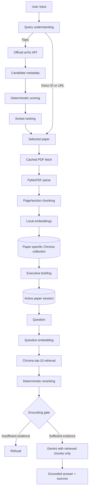

# ArXiv Research Copilot

> **Autonomous Paper Digest & Grounded QA Agent**  
> Search the official arXiv API, select the right paper, build a local RAG
> index, and ask questions that are answered only from retrieved evidence.

<p align="center">
  
  
  
  
  
</p>

## Why this project stands out

Most paper assistants send an entire document to a language model and hope for
the best. This project demonstrates a more defensible engineering approach:

1. Resolve papers only through the official arXiv API.
2. Rank topic-search candidates deterministically before downloading PDFs.
3. Extract page-aware text locally with PyMuPDF.
4. Store paper-isolated chunks and normalized embeddings in ChromaDB.
5. Retrieve a broad candidate set, rerank it, and keep only the best evidence.
6. Reject unsupported questions **before** Gemini is called.
7. Return answers with paper and page provenance.

The result is a small, explainable, recruiter-ready RAG system rather than a
monolithic prompt or a collection of unrelated agents.

## Product capabilities

- Topic search with candidate metadata, score breakdowns, ranking order, and
  selected paper.
- Direct lookup by arXiv ID or URL.
- Official HTTPS arXiv Atom API with URL encoding, descriptive User-Agent,
  timeout, retry, and 406 fallback handling.
- PDF caching under `data/pdfs/`.
- Text extraction and page/section-aware overlapping chunks.
- Local `sentence-transformers/all-MiniLM-L6-v2` embeddings; no HF token
  required.
- Persistent paper-specific ChromaDB collections under `data/chroma/`.
- Two-stage dense retrieval plus deterministic lexical/vector reranking.
- Grounding gate that prevents unsupported Gemini calls.
- Source-aware answers with paper/page/section metadata.
- Persistent active-paper session for QA without repeating `--paper`.
- Safe local embedding removal and cached-PDF re-indexing.
- Optional retrieval diagnostics with `--debug`.
- Graceful handling of API, PDF, extraction, embedding, Chroma, and Gemini
  failures.

## Architecture



### LangGraph workflow

The graph is explicit and stateful:

```text
START
  -> classify
  -> search
  -> index
  -> retrieve
  -> generate
  -> END
```

The node names are intentionally compact, while their responsibilities are
clear:

| Node | Responsibility |
|---|---|
| `classify` | Distinguish topic search, direct paper, briefing, and QA |
| `search` | Resolve direct papers or retrieve topic candidates; rank them |
| `index` | Download/reuse the selected PDF, parse it, chunk it, and index it |
| `retrieve` | Query the selected paper's collection and rerank chunks |
| `generate` | Create a briefing, grounded answer, or refusal |

Topic searches select one paper before `index` runs. Direct paper requests
bypass candidate ranking and resolve the requested paper exactly.

## State design

`ResearchState` carries the data between graph nodes:

```text
query
classification
max_results
papers
selected_papers
candidate_scores
direct_paper_id
context_paper_id
chunks
retrieved_candidates
reranked_chunks
retrieved
briefing
answer
sources
grounding_score
grounded
conversation_history
active_paper_id
collection_name
errors
```

This keeps retrieval, grounding, and generation connected without passing the
entire application state to Gemini.

## Topic search and ranking

```text
Topic
  -> arXiv metadata candidates
  -> title/abstract/category scoring
  -> deterministic sort
  -> selected paper
  -> PDF fetch and indexing
```

Each candidate displays:

- title
- authors
- abstract preview
- arXiv ID
- publication date
- categories
- PDF URL
- abstract URL
- title, abstract, category, and final relevance scores

Scores are normalized to `0.0`–`1.0`. The current implementation uses:

```text
0.55 × title relevance
0.30 × abstract relevance
0.15 × category relevance
```

It also applies a small capped exact-title phrase bonus. This is intentionally
simple, deterministic, and explainable; Gemini is never used as a ranker.

Run:

```powershell
python -m app.main search "graph neural networks"
```

The command prints candidate metadata, score breakdowns, sorted ranking results,
and the selected paper. Search itself does not download candidate PDFs.

## Real RAG pipeline

### PDF parsing and chunking

Only the selected paper enters the document pipeline. PyMuPDF extracts text
page by page. Chunks preserve:

```text
paper_id
chunk_id
page
section
start/end offsets
text
```

Chunks use overlapping page-local windows rather than one blind split of the
whole paper. Scanned or textless PDFs fail with a clear extraction message;
OCR is deliberately not used.

### Embeddings and ChromaDB

The default local embedding model is:

```text
sentence-transformers/all-MiniLM-L6-v2
```

Embeddings are normalized and indexed in persistent ChromaDB:

```text
data/chroma/
```

Every paper gets a deterministic collection such as:

```text
paper_1706_03762
```

Metadata and documents are stored together. Stable chunk IDs and upsert logic
prevent duplicate indexing. Queries include a paper metadata filter, so one
paper cannot contaminate another paper's QA.

### Two-stage retrieval and reranking

```text
Question
  -> query embedding
  -> Chroma top 10 dense candidates
  -> deterministic lexical/vector reranking
  -> final top 5 chunks
  -> grounding gate
  -> Gemini
```

The reranker combines the Chroma relevance score with a lightweight lexical
overlap score. It preserves all chunk provenance and avoids introducing a
second model or a costly cross-encoder.

### Grounding and hallucination prevention

The grounding gate checks the best reranked score against
`GROUNDING_THRESHOLD` (default `0.20`). If evidence is insufficient:

```text
I couldn't find enough information in the paper to answer that.
```

Gemini is not called in that branch. When evidence is sufficient, Gemini
receives only the final retrieved excerpts and instructions to use no outside
knowledge or invented facts.

## Source-aware answers

The final answer includes a `Sources` section derived from retrieved chunks:

```text
Sources:
- Page 3 — Figure 1: The Transformer — arXiv:1706.03762
```

The same provenance flows through:

```text
PDF -> parser -> chunk -> Chroma metadata -> retrieval -> reranking
     -> grounding -> Gemini context -> final sources
```

Missing metadata is omitted or shown as unavailable; page and section values
are never fabricated.

## Active-paper sessions

After a successful briefing:

```powershell
python -m app.main brief 1706.03762
```

the selected paper becomes active. The lightweight local file
`data/session.json` stores only:

```json
{
  "paper_id": "1706.03762",
  "collection_name": "paper_1706_03762",
  "title": "Attention Is All You Need",
  "abs_url": "https://arxiv.org/abs/1706.03762"
}
```

Then QA works without a paper flag:

```powershell
python -m app.main ask "What architecture does the paper propose?"
```

An explicit `--paper` always overrides the active session:

```powershell
python -m app.main ask "What are the key results?" --paper 1706.03762
```

With neither an active paper nor `--paper`, the CLI refuses to guess:

```text
No active paper is selected. Run 'brief <arxiv_id>' or provide --paper <arxiv_id> first.
```

## Debug mode

Normal output stays concise. Add `--debug` to inspect retrieval behavior:

```powershell
python -m app.main ask "What architecture does the paper propose?" --debug
```

Diagnostics include:

- active paper and collection
- initial candidate count
- reranked/final chunk count
- chunk IDs
- scores
- page and section metadata
- grounding decision and score

Debug mode never prints API keys or credentials and does not dump the full PDF.

## Remove and re-index embeddings

Remove only one paper's local vector index:

```powershell
python -m app.main remove 1706.03762
```

This deletes:

- the paper's deterministic Chroma collection
- its stored chunks, embeddings, and metadata
- the active session if that paper was active

This keeps:

- the arXiv source
- the cached PDF in `data/pdfs/`
- unrelated paper collections
- unrelated metadata caches

Rebuild from the cached PDF:

```powershell
python -m app.main brief 1706.03762
```

The collection and embeddings are recreated, the paper becomes active again,
and QA works normally.

## Caching and reuse

| Artifact | Location | Reuse behavior |
|---|---|---|
| arXiv metadata | `data/arxiv.json` | Stable query/ID cache |
| PDFs | `data/pdfs/<id>.pdf` | Valid PDFs are reused |
| Chroma index | `data/chroma/` | Existing chunk IDs are upsert-safe |
| active paper | `data/session.json` | Restores cross-process QA context |
| briefings | `data/briefings.json` | Reuses same-paper/query briefings |

Deleting embeddings intentionally invalidates only the Chroma layer; the PDF
cache remains available for fast re-indexing.

## CLI reference

```powershell
# Interactive briefing and follow-up QA
python -m app.main prompt

# Topic search and ranking
python -m app.main search "retrieval augmented generation" -n 5

# Direct paper briefing
python -m app.main brief 1706.03762
python -m app.main brief https://arxiv.org/abs/1706.03762

# QA using active paper or explicit override
python -m app.main ask "What is the main contribution?"
python -m app.main ask "What is the main contribution?" --paper 1706.03762
python -m app.main ask "What is the main contribution?" --debug

# Structured state output
python -m app.main ask "What is the main contribution?" --json

# Remove only local embeddings/index data
python -m app.main remove 1706.03762
```

## Example workflow

```powershell
python -m app.main brief 1706.03762
python -m app.main ask "What architecture does the paper propose?"
python -m app.main ask "Why was this architecture chosen?"
python -m app.main ask "What is something the paper does not explain?"
```

Illustrative behavior:

```text
Q: What architecture does the paper propose?
A: The paper proposes the Transformer architecture ... [arXiv:1706.03762, p.3]
Sources:
- Page 3 — arXiv:1706.03762

Q: Why was this architecture chosen?
A: The paper motivates attention-based layers to improve parallelization and
   reduce sequential dependencies ... [arXiv:1706.03762, p.1]

Q: What is something the paper does not explain?
A: I couldn't find enough information in the paper to answer that.
```

Exact wording can vary with Gemini responses, but unsupported questions must
take the refusal path rather than receive an outside-knowledge answer.

## Setup

Requirements:

- Python 3.10+
- Internet access for arXiv and Gemini
- A Gemini API key

```powershell
cd D:\assessmen
python -m venv .venv
.\.venv\Scripts\Activate.ps1
pip install -r requirements.txt
Copy-Item .env.example .env
```

Set only the required secret in `.env`:

```dotenv
GEMINI_API_KEY=your_key_here
GEMINI_MODEL=gemini-flash-lite-latest
EMBEDDING_MODEL=sentence-transformers/all-MiniLM-L6-v2
GROUNDING_THRESHOLD=0.20
```

No `ARXIV_API_KEY`, `HF_TOKEN`, OpenAI key, database server, Redis, Docker,
Ollama, or frontend configuration is required.

## Testing

Run the local suite:

```powershell
.\.venv\Scripts\python.exe -m pytest -q
```

The suite covers:

- arXiv endpoint construction, headers, parsing, and caching
- direct resolution and topic ranking
- deterministic sorted selection
- selected paper reaching PDF fetch
- no candidate PDF downloads during topic search
- PDF validation and chunk IDs
- graph wiring
- active-paper session persistence
- safe embedding removal
- missing collection handling
- grounding/refusal behavior
- CLI metadata, ranking, and selection output

The optional live integration test requires:

```powershell
$env:RUN_NETWORK_TESTS="1"
.\.venv\Scripts\python.exe -m pytest -q tests/test_integration.py
```

## Failure handling

The application surfaces actionable messages for:

- empty or malformed arXiv input
- zero search results
- arXiv HTTP/network errors, including 406 responses
- invalid or oversized PDF responses
- poor text extraction
- empty chunks
- embedding or Chroma failures
- missing active paper or deleted collection
- insufficient grounding
- Gemini/API failures

Normal user errors do not require a traceback. Runtime artifacts and secrets are
ignored by `.gitignore`.

## Design decisions and tradeoffs

| Decision | Why |
|---|---|
| LangGraph | Makes state transitions and workflow stages visible |
| Official arXiv API | Reliable metadata source without scraping |
| Local sentence-transformers | Reproducible, low-cost embeddings |
| ChromaDB | Persistent local vector storage with simple isolation |
| Deterministic ranking | Explainable and reproducible for an assessment |
| Two-stage retrieval | Broader recall followed by smaller grounded context |
| Gemini only after grounding | Prevents unsupported generation |
| CLI only | Keeps scope focused on AI engineering |

## Known limitations

- PDF extraction is text-only and does not support OCR.
- Section detection is heuristic and varies across PDF layouts.
- The lightweight embedding model is suitable for a focused local corpus, not
  a large production-scale index.
- Ranking is a transparent heuristic, not a benchmarked learning-to-rank model.
- Gemini, arXiv availability, network access, and free-tier quotas remain
  external dependencies.
- Conversation history is maintained for the interactive `prompt` session;
  the persistent cross-process session stores active-paper metadata only.

## Future improvements

- Add retrieval evaluation metrics and a small curated benchmark.
- Improve section detection for multi-column and unusual PDFs.
- Add optional streaming output while preserving the grounding gate.
- Add structured telemetry for cache hits, retrieval scores, and API retries.
- Add a safe multi-paper comparison mode without weakening paper isolation.

## Project classification

**Keep — runtime:** `app/`, `requirements.txt`, `.env.example`  
**Keep — documentation/tests:** `README.md`, `MANUAL_TESTING.md`, `tests/`  
**Keep — runtime directories:** `data/pdfs/`, `data/chroma/`  
**Optional:** `examples/`  
**Ignored/generated:** `.venv/`, `__pycache__/`, `.pytest_cache/`, local `.env`,
PDFs, Chroma files, session state, and JSON caches.
