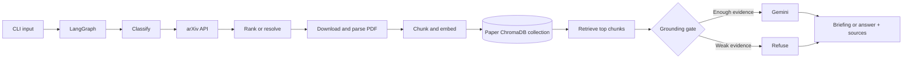

<div align="center">

# ArXiv Research Copilot

**Local RAG for paper discovery, briefings, and grounded Q&A**


</div>

ArXiv Research Copilot accepts a research topic, arXiv ID, or arXiv URL. It
finds the paper, downloads and parses its PDF, creates a local vector index,
generates a structured briefing, and answers follow-up questions from retrieved
paper chunks.

**Core rule:** retrieve evidence first; do not answer when evidence is weak.

## Features

- Official arXiv API search and direct paper resolution
- Deterministic candidate ranking
- PDF download and page-aware parsing with PyMuPDF
- Local Sentence Transformers embeddings
- Persistent ChromaDB storage
- One isolated vector collection per paper
- Structured Gemini briefing with Pydantic validation
- Grounded QA with page and section sources
- Persistent interactive CLI
- JSON output, Markdown briefing export, debug retrieval, and index removal
- Explicit search, fetch, parse, index, and QA statuses

## Architecture



The compiled graph is:

```text
START → classify → search → index → retrieve → generate → END
```

QA sends Gemini the question, bounded conversation history, and retrieved
chunks only. It never sends the full PDF. If the best retrieval score is below
`GROUNDING_THRESHOLD`, Gemini is not called.

## Technology stack

| Area | Technology |
| --- | --- |
| Language | Python 3.10+ |
| Workflow | LangGraph |
| arXiv access | Official arXiv Atom API |
| PDF processing | PyMuPDF |
| Embeddings | Sentence Transformers |
| Vector store | ChromaDB |
| LLM | Google Gemini via `google-genai` |
| Validation | Pydantic |
| CLI | Python `argparse` and interactive shell |
| Tests | pytest |

## Project structure

```text
app/
├── main.py                  CLI and interactive session
├── graph.py                 LangGraph assembly
├── nodes.py                 Search, indexing, retrieval, briefing, QA
├── state.py                 Typed state and Pydantic models
└── services/
    ├── arxiv.py             arXiv API client and caching
    ├── cache.py             Atomic JSON cache
    ├── config.py            Environment and service construction
    ├── embeddings.py        Lazy local embedding model
    ├── gemini.py            Briefing and grounded QA prompts
    ├── pdf.py               Download, extraction, and chunking
    ├── session.py           Active-paper persistence
    └── vector_store.py      ChromaDB indexing and retrieval
tests/                       Unit, graph, CLI, RAG, and integration tests
data/
├── chroma/.gitkeep          Generated ChromaDB data goes here
└── pdfs/.gitkeep            Downloaded PDFs go here
```

Generated runtime files under `data/` are ignored by Git.

## Setup

Requirements: Python 3.10+, network access, and a Gemini API key for briefing
and QA generation.

```bash
git clone https://github.com/amruthssss/Autonomous_arXiv_Assessment-.git
cd Autonomous_arXiv_Assessment-

python -m venv .venv
```

Windows PowerShell:

```powershell
.venv\Scripts\Activate.ps1
python -m pip install --upgrade pip
pip install -r requirements.txt
```

macOS/Linux:

```bash
source .venv/bin/activate
python -m pip install --upgrade pip
pip install -r requirements.txt
```

Create `.env` from `.env.example`:

```dotenv
GEMINI_API_KEY=your_gemini_api_key
GEMINI_MODEL=gemini-flash-lite-latest
EMBEDDING_MODEL=sentence-transformers/all-MiniLM-L6-v2
GROUNDING_THRESHOLD=0.20
ARXIV_MIN_REQUEST_INTERVAL=3.0
```

`GEMINI_API_KEY` is required for Gemini generation. The embedding model is
downloaded locally on first indexing; no Hugging Face token is required by the
default model.

## Run

Start the interactive CLI:

```bash
python -m app.main
```

Typical workflow:

```text
> search retrieval augmented generation
> select 1
> fetch
> summarise
> ask What is the main contribution?
> ask What are the limitations?
> export briefing.md
> exit
```

Topic search automatically selects the best result. `select <number>` changes
the selection. `fetch` downloads, parses, chunks, embeds, and indexes the
active paper. Existing valid indexes are reused.

Open a paper directly:

```text
> 1706.03762
```

The CLI also accepts arXiv URLs.

## Interactive commands

```text
search <topic>     Search arXiv
select <number>    Select a search result
fetch              Download and index the active paper
summarise          Generate the executive briefing
ask <question>     Ask about the active paper
papers             List indexed papers
switch <number>    Switch indexed paper
current            Show the active paper
status             Show pipeline and index status
export [file]      Export the briefing to Markdown
help               Show commands
exit               Exit
```

## One-shot commands

```bash
python -m app.main search "retrieval augmented generation"
python -m app.main brief 1706.03762
python -m app.main ask "What is the main contribution?" --paper 1706.03762
python -m app.main ask "How does the method work?" --paper 1706.03762 --debug
python -m app.main brief 1706.03762 --json
python -m app.main remove 1706.03762
python -m app.main prompt "graph neural networks"
```

`qa` is an alias for `ask`.

## Grounded QA

For each question:

```text
question
  → local query embedding
  → active paper's ChromaDB collection
  → top five chunks
  → grounding threshold
  → Gemini answer + sources
```

An unsupported question returns:

```text
QA_STATUS: INSUFFICIENT_EVIDENCE
```

Gemini is skipped in this case. Use `--debug` to inspect the active paper,
collection, retrieved chunks, scores, and grounding score.

## Status and failure handling

The CLI distinguishes:

- `SEARCH_STATUS`: success, no results, API unavailable, or error
- `FETCH_STATUS`: PDF download result
- `PARSE_STATUS`: PDF parsing result
- `INDEX_STATUS`: vector index result
- `QA_STATUS`: grounded or insufficient evidence

Transient arXiv failures use bounded retry handling. A parsed paper whose local
indexing fails can be retried with `fetch`. Invalid IDs, missing papers, broken
PDFs, malformed output, Gemini failures, and corrupted indexes are surfaced as
errors rather than treated as successful results.

## Testing

Run the test suite:

```bash
pytest -q
```

Additional checks:

```bash
python -m compileall app tests
git diff --check
```

Tests cover arXiv parsing and failures, PDF chunking, graph assembly, CLI
rendering, state persistence, paper isolation, index reuse, grounding, and the
Gemini evidence boundary. The optional live integration test is skipped when
its environment requirements are unavailable.

## Caching and generated data

The application creates these local artifacts:

- `data/pdfs/`: downloaded paper PDFs
- `data/chroma/`: persistent vector collections
- `data/arxiv.json`: arXiv metadata cache
- `data/briefings.json`: briefing cache
- `data/session.json`: active-paper state
- local Sentence Transformers model cache

They are reproducible and intentionally excluded from Git. A fresh clone
recreates them through the normal `fetch` and `summarise` workflow.

## Design tradeoffs

- **LangGraph:** makes the workflow and shared state explicit.
- **Local embeddings:** avoids embedding API cost and keeps retrieval local.
- **ChromaDB:** provides simple persistent local vector storage.
- **Deterministic ranking:** is reproducible and easy to inspect.
- **Paper isolation:** prevents cross-paper retrieval.
- **CLI scope:** focuses the project on RAG and reliability rather than UI.

## Limitations

- Scanned PDFs are not OCR-processed.
- Tables, equations, and unusual layouts may parse imperfectly.
- The grounding threshold is a practical heuristic, not calibrated confidence.
- Gemini requires an API key and network access.
- arXiv may rate-limit requests.
- This is an assessment-focused CLI, not a production deployment.

## Video

See [VIDEO_SCRIPT.md](VIDEO_SCRIPT.md) for the four-minute demonstration and
reflection script.

## Author

**Amruth S Sharma**

[GitHub](https://github.com/amruthssss) ·
[LinkedIn](https://www.linkedin.com/in/amruthssharma)
